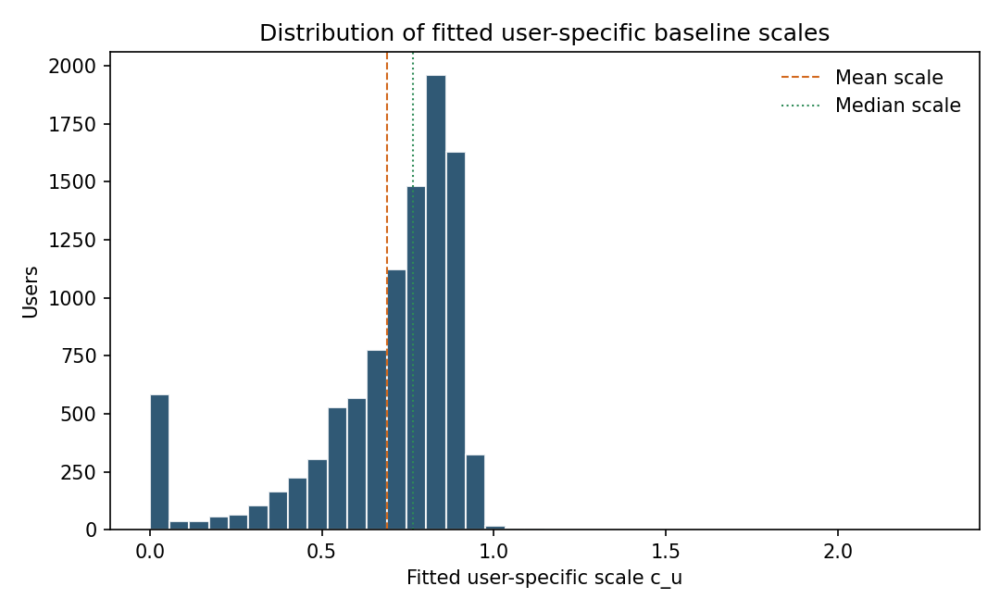
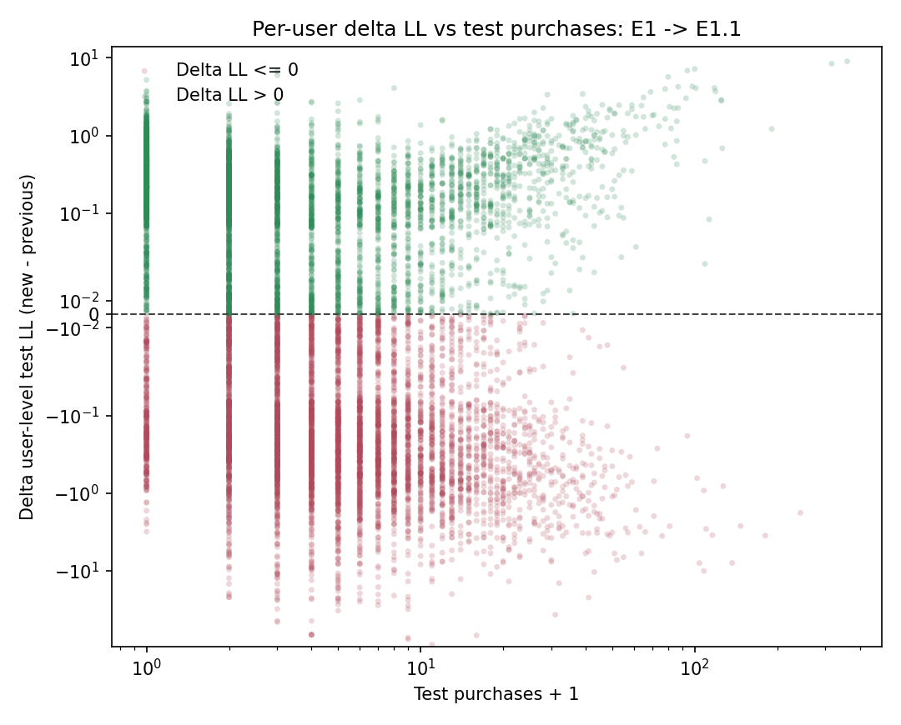

# 06.1. Hawkes с глобальными ядрами и индивидуальными user-scale

## 6.1.1. Идея эксперимента

После выбора основной Hawkes-модели из главы 06 возникает естественный следующий вопрос.

Отдельно от выбора числа half-life можно проверить более гибкую постановку, в которой Hawkes-коэффициенты по-прежнему обучаются глобально на всей панели, а поверх baseline используется индивидуальный пользовательский scale. Внутри этой side-branch используется расширенный базис `(1,3,7,21)`:

$$
\lambda_{u,t}
=
c \cdot \lambda_{\mathrm{base}}(u,t)
+
\sum_{j,m}\alpha_{j,m} z_{u,j,m,t}.
$$

Однако можно попробовать более гибкую постановку:

1. Hawkes-коэффициенты $\alpha_{j,m}$ оставить глобальными;
2. а параметр масштаба baseline обучать индивидуально для каждого пользователя.

Иными словами, здесь проверяется гипотеза о том, что краткосрочная Hawkes-структура может быть общей для всех пользователей, а вот общий уровень baseline после учета Hawkes-сигнала стоит перекалибровывать индивидуально.

Как и в основной модели из главы 06, здесь используется уже сокращенный набор каналов:

1. `searches`;
2. `cat_to_cart`;
3. `cat_to_ord`;
4. `to_cart`;
5. `to_ord`.

## 6.1.2. Модель

В этой главе используется модель вида

$$
\lambda_{u,t}
=
c_u \cdot \lambda_{\mathrm{base}}(u,t)
+
\sum_{j=1}^{J}\sum_{m=1}^{M}\alpha_{j,m} z_{u,j,m,t},
$$

где:

1. $\lambda_{\mathrm{base}}(u,t)$ — personalized rolling seasonal Poisson из главы 4;
2. $\alpha_{j,m}$ — pooled Hawkes-коэффициенты, общие для всей панели;
3. $c_u$ — индивидуальный пользовательский scale.

Важно: в этой постановке Hawkes-ядра не переобучаются на пользователя. Индивидуализируется только multiplicative correction к baseline.

## 6.1.3. Как обучается модель

Обучение разбивается на два этапа.

### Этап 1. Глобальная Hawkes-часть

Сначала строится глобальная Hawkes-модель на расширенном базисе `(1,3,7,21)`:

$$
\lambda^{(1)}_{u,t}
=
\hat c \cdot \lambda_{\mathrm{base}}(u,t)
+
\sum_{j,m}\hat\alpha_{j,m} z_{u,j,m,t}.
$$

То есть сначала на всей train-панели оцениваются:

1. pooled коэффициенты $\hat\alpha_{j,m}$;
2. общий scale $\hat c$.

В текущем запуске получено:

$$
\hat c = 0.8162.
$$

### Этап 2. Индивидуальные масштабы

После этого коэффициенты $\hat\alpha_{j,m}$ фиксируются, а для каждого пользователя $u$ отдельно оценивается параметр $c_u$ из задачи

$$
\hat c_u
=
\arg\max_{c_u \ge 0}
\sum_{t \in \mathcal T_{\mathrm{train}}(u)}
\left[
y_{u,t}\log\left(c_u \lambda_{\mathrm{base}}(u,t) + e_{u,t}\right)
-
\left(c_u \lambda_{\mathrm{base}}(u,t) + e_{u,t}\right)
\right],
$$

где

$$
e_{u,t} = \sum_{j,m}\hat\alpha_{j,m} z_{u,j,m,t}.
$$

То есть для каждого пользователя при уже известной Hawkes-надстройке подбирается свой оптимальный коэффициент масштабирования baseline.

Для пользователей, отсутствующих на train, используется fallback

$$
c_u = \hat c.
$$

## 6.1.4. Протокол и реализация

Протокол тот же, что и в предыдущих главах:

1. окно анализа: `2025-01-15` -> `2025-09-30`;
2. train: до `2025-08-09`;
3. test: с `2025-08-10` по `2025-09-30`;
4. evaluation: sequential one-step-ahead.

Код:

1. модель: `src/diploma_experimental/hawkes.py`;
2. pipeline: `src/diploma_experimental/pipeline.py`;
3. раннер: `scripts/run_experimental_1_1_hawkes.py`.

Артефакты:

1. `diploma/reports/experimental_1_1_hawkes/summary.json`;
2. `diploma/reports/experimental_1_1_hawkes/daily_aggregate_analysis_window.png`;
3. `diploma/reports/experimental_1_1_hawkes/delta_ll_vs_test_purchases_e1_to_e11.png`;
4. `diploma/reports/experimental_1_1_hawkes/user_scale_hist.png`;
5. `diploma/reports/experimental_1_1_hawkes/user_scales.csv`.

## 6.1.5. Сравнение с моделью из главы 06

Текущая основная модель из главы 06 и вариант из этой главы отличаются сразу в двух аспектах:

1. в главе 06 используется компактный базис half-life `(1,3)` и один общий $\hat c$;
2. в этой главе используется расширенный базис `(1,3,7,21)` и индивидуальные $\hat c_u$.

### Test: глава `06.1` против главы `06`

| Metric | Hawkes из главы 06 | User-scale Hawkes | Delta new - chapter 06 |
| --- | ---: | ---: | ---: |
| `poisson_loglik` | `-203093.06` | `-206789.01` | `-3695.95` |
| `mean_poisson_nll` | `0.39580` | `0.40300` | `+0.00720` |
| `mean_poisson_deviance` | `0.61926` | `0.63367` | `+0.01441` |
| `MAE` | `0.21691` | `0.21515` | `-0.00176` |
| `RMSE` | `0.62719` | `0.62823` | `+0.00104` |

Картина получается очень характерной:

1. по `MAE` индивидуальный scale дает небольшой дополнительный выигрыш;
2. но по likelihood-метрикам модель заметно хуже модели из главы 06;
3. по `RMSE` она тоже немного хуже;
4. значит дополнительная персонализация baseline не улучшает качество в вероятностном смысле.

Это важный результат: более гибкая персонализация здесь не помогает, а начинает мешать.

## 6.1.6. Как распределились user-scales

Гистограмма оцененных пользовательских масштабов:

Численно:

1. `mean(c_u) = 0.6897`;
2. `median(c_u) = 0.7652`;
3. `q10 = 0.3855`;
4. `q90 = 0.8916`;
5. `5.60%` пользователей упираются в нижнюю границу `c_u = 0`.

Это очень показательно:

1. большинство пользовательских масштабов оказываются ниже глобального `\hat c = 0.8162` из внутреннего global-fit этой side-branch;
2. только `35.0%` пользователей получают scale выше глобального;
3. лишь `0.18%` пользователей получают scale выше `1`.

Иными словами, второй этап персонализации в основном не усиливает baseline, а почти повсеместно его дополнительно занижает.

## 6.1.7. User-level картина

Ниже показано, как user-level `delta LL` зависит от числа покупок в test при прямом сравнении модели из этой главы с основной Hawkes-моделью из главы 06:

Сводка по сравнению с моделью из главы 06:

1. `share(new > prev) = 45.0%`;
2. `mean_delta_ll = -0.3724`;
3. `median_delta_ll = -0.0197`.

Особенно характерно, что по сравнению с моделью из главы 06 новый вариант в основном выигрывает у пользователей с `0` покупок в test, но проигрывает в более активных сегментах:

1. `0` покупок: `share(new > prev) = 81.9%`, `mean_delta_ll = +0.3169`;
2. `1` покупка: `54.3%`, `mean_delta_ll = -0.1522`;
3. `2` покупки: `36.4%`, `mean_delta_ll = -0.4825`;
4. `3-5` покупок: `27.7%`, `mean_delta_ll = -0.7252`;
5. `6-10` покупок: `30.4%`, `mean_delta_ll = -0.6760`;
6. `11+` покупок: `43.7%`, `mean_delta_ll = -0.3988`.

То есть user-specific `c_u` делает модель более консервативной и помогает прежде всего на очень слабых пользователях, но за это приходится платить качеством на более содержательной части панели.

## 6.1.8. Интерпретация результата

Этот эксперимент дает полезный отрицательный результат.

Глава 4 уже ввела сильную персонализацию через $\mu_u$ в базовом Пуассоне. После этого модель из главы 06 добавила:

1. глобальную перекалибровку baseline через $\hat c$;
2. pooled Hawkes-memory поверх baseline.

Попытка затем ввести еще один пользовательский multiplicative scale $c_u$ фактически означает вторую волну персонализации поверх уже personalized baseline.

Судя по результатам, это оказывается избыточным:

1. модель начинает слишком сильно занижать интенсивность для многих пользователей;
2. это немного помогает по `MAE` и особенно на совсем слабых пользователях;
3. но ухудшает likelihood и качество на средне- и высокоактивных сегментах по сравнению с моделью из главы 06.

Иначе говоря, в этой постановке индивидуальный `c_u` начинает подгонять редкие train-наблюдения пользователя, а не вытаскивать устойчивую новую структуру.

## 6.1.9. Вывод

Этот эксперимент не улучшает основную Hawkes-модель из главы 06.

1. По сравнению с моделью из главы 06 вариант с индивидуальными `c_u` проигрывает по основным вероятностным метрикам.
2. Следовательно, для текущего датасета и текущего baseline дополнительная индивидуализация коэффициента $c_u$ избыточна.
3. Это хороший negative result: после главы 06 следующую прибавку качества стоит искать не в еще одной multiplicative personalization, а в более содержательной структуре Hawkes-части или в richer features.

Практический вывод из этой главы простой: модель из главы 06 остается основным Hawkes-кандидатом, а раздел 06.1 фиксирует границу полезности дополнительной персонализации.
