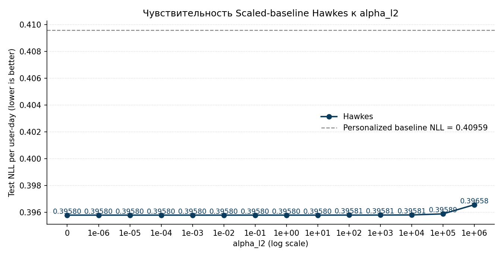
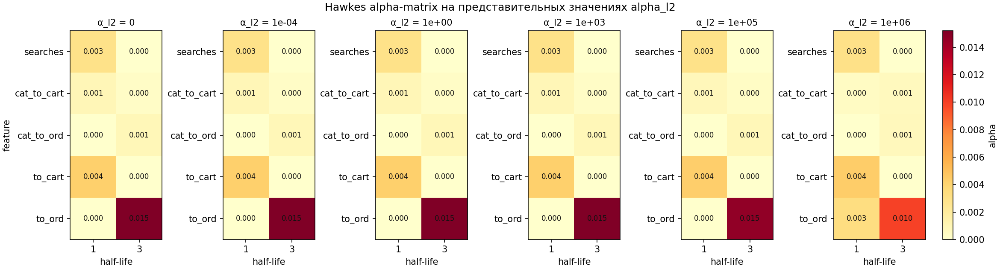
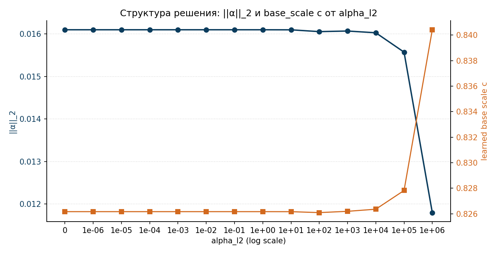

# 06b. Чувствительность Hawkes к alpha_l2

## 6b.1. Зачем нужен этот эксперимент

В главе 6 у Scaled-baseline Hawkes есть два регуляризационных параметра:

1. `alpha_l2` — штраф на $\|\alpha\|_2^2$ для pooled Hawkes-коэффициентов;
2. `scale_l2` — штраф на $(c - 1)^2$ для обучаемого базового scale.

В основном прогоне они зафиксированы в `alpha_l2 = 1e-4` и `scale_l2 = 10.0`. Это разумные значения, но никакого специального исследования по чувствительности в главе 6 не проводилось. После cross-validation в главе 10 стало особенно важно понять, насколько модель устойчива к выбору `alpha_l2`: в коротких блоках Hawkes выродился в personalized baseline, и одна из правдоподобных гипотез — что регуляризация в этом режиме доминирует над данными.

В этой главе проводится sweep по `alpha_l2` на основном split-е из главы 6 (train: `2025-01-15` → `2025-08-09`, test: `2025-08-10` → `2025-09-30`). Все остальные параметры остаются такими же, как в главе 6: `half_lives = (1, 3)`, `learn_base_scale = True`, `scale_l2 = 10.0`, `max_iter = 300`.

## 6b.2. Сетка значений

Использовалась расширенная сетка `alpha_l2`:

$$
\{0,\ 10^{-6},\ 10^{-5},\ 10^{-4},\ 10^{-3},\ 10^{-2},\ 10^{-1},\ 1,\ 10,\ 10^{2},\ 10^{3},\ 10^{4},\ 10^{5},\ 10^{6}\}.
$$

Малая часть сетки $\{0, 10^{-6}, \ldots, 10^{-3}\}$ нужна, чтобы проверить чувствительность вокруг рабочего значения. Расширение до `1e6` нужно, чтобы найти точку, в которой регуляризация действительно начинает влиять на решение.

## 6b.3. Test NLL по сетке

| `alpha_l2` | Test NLL/n | learned `c` | $\|\alpha\|_2$ |
| ---: | ---: | ---: | ---: |
| `0` | `0.39580` | `0.8262` | `0.0161` |
| `1e-6` | `0.39580` | `0.8262` | `0.0161` |
| `1e-5` | `0.39580` | `0.8262` | `0.0161` |
| `1e-4` | `0.39580` | `0.8262` | `0.0161` |
| `1e-3` | `0.39580` | `0.8262` | `0.0161` |
| `1e-2` | `0.39580` | `0.8262` | `0.0161` |
| `1e-1` | `0.39580` | `0.8262` | `0.0161` |
| `1.0` | `0.39580` | `0.8262` | `0.0161` |
| `1e1` | `0.39580` | `0.8262` | `0.0161` |
| `1e2` | `0.39581` | `0.8261` | `0.0161` |
| `1e3` | `0.39581` | `0.8262` | `0.0161` |
| `1e4` | `0.39581` | `0.8264` | `0.0160` |
| `1e5` | `0.39589` | `0.8278` | `0.0156` |
| `1e6` | `0.39658` | `0.8404` | `0.0118` |

Personalized baseline NLL для сравнения: `0.40959`.

## 6b.4. Что видно

1. На всём диапазоне `alpha_l2` $\in [0,\ 10^4]$ модель **полностью нечувствительна**: test NLL, learned `c` и $\|\alpha\|_2$ совпадают вплоть до 4-го знака после запятой.
2. Только при `alpha_l2` $\geq 10^5$ начинают проявляться эффекты регуляризации: $\|\alpha\|_2$ постепенно сжимается, `c` подтягивается к `1`, NLL слегка деградирует.
3. Даже при `alpha_l2 = 10^6` test NLL = `0.39658` всё ещё существенно лучше personalized baseline `0.40959` — модель не вырождается полностью, а только частично сжимает Hawkes-коэффициенты.

Это важный позитивный sanity check: **чтобы сместить рабочее решение из главы 6, нужно увеличить `alpha_l2` примерно на 9 порядков** (с `1e-4` до `1e5`). В прикладном смысле это означает, что результат главы 6 устойчив к разумным вариациям этого гиперпараметра.

## 6b.5. Структура коэффициентов

Ниже показаны heatmap-матрицы Hawkes-коэффициентов на представительных значениях `alpha_l2`. Видно, что вплоть до `1e5` структура коэффициентов сохраняется почти идеально: основная масса в `to_ord` с half-life 3, заметные вклады `searches` и `to_cart` на half-life 1, минимальные category-based каналы. Только при `alpha_l2 = 1e6` структура начинает разваливаться: вес у `to_ord(hl=3)` падает с `0.015` до `0.010`, появляются ненулевые коэффициенты у `to_ord(hl=1)` и `cat_to_cart(hl=3)` — модель пытается размазать оставшийся сигнал.

## 6b.6. Норма $\|\alpha\|_2$ и base scale `c`

Тот же эффект на одном графике в виде линий: до `1e4` ровные плато, после — резкое сокращение нормы и подъём `c` к единице.

Этот график также объясняет, почему регуляризация так слабо проявляет себя в основном диапазоне. На обученном решении $\|\alpha\|_2 \approx 0.0161$, поэтому регуляризационный штраф равен `alpha_l2` $\cdot$ $\|\alpha\|_2^2$ $\approx$ `2.6e-4 · alpha_l2`. На train-выборке примерно в `2 \cdot 10^6` `user-day` log-likelihood-выигрыш от Hawkes-надстройки относительно personalized baseline составляет порядка `4 \cdot 10^3` нат. Чтобы регуляризационный штраф стал сопоставим с этим выигрышем, нужно `alpha_l2` $\sim \frac{4 \cdot 10^3}{2.6 \cdot 10^{-4}} \approx 10^7$. В нашем sweep чувствительность начинает проявляться чуть раньше, при `1e4`–`1e5`, потому что регуляризационная масса распределена нелинейно по координатам $\alpha_{j,m}$, но порядок величины тот же.

## 6b.7. Связь с cross-validation главы 10

В блочной CV из главы 10 предсказания Hawkes и Personalized совпадали побайтово. Естественно было бы предположить, что на коротком train регуляризация начинает доминировать и пинает оптимум в degenerate point $(c, \alpha) = (1, 0)$. Однако отдельно проверенный sweep по обоим регуляризаторам непосредственно в CV-протоколе показывает, что это **не так**: вырождение наступает одинаково при `alpha_l2 ∈ {0, 1e-4}` и `scale_l2 ∈ {0, 0.1, 10}`, и не снимается даже warm-start'ом из решения главы 6.

То есть на 14-дневных окнах $(c=1, \alpha=0)$ — это **истинный train-loss оптимум** в staged-постановке, а не точка, в которую загоняет регуляризация. Содержательная причина: in-sample EB-shrinkage в personalized baseline на 14d поглощает почти всё, что Hawkes-надстройка могла бы добавить, и `α=0` действительно оптимально. Joint-обучение `λ_u` с более мягким L2-prior'ом эту проблему снимает — см. главу 14.

Чтобы быть конкретным про сам sensitivity: для основного split-а из главы 6 рабочее значение `alpha_l2 = 1e-4` действует **как `alpha_l2 = 0`** — `||α||_2 \cdot \mathrm{alpha\_l2} \approx 2.6 \cdot 10^{-8}`, что на много порядков меньше data-likelihood-выигрыша от Hawkes-надстройки. Это уже существенный результат сам по себе и совершенно отдельный от вопроса вырождения на коротких окнах.

## 6b.8. Выводы

1. На основном split-е из главы 6 модель **практически не зависит** от выбора `alpha_l2` в диапазоне `[0, 1e4]`. Текущее значение `1e-4` ведёт себя как «нет регуляризации».
2. Регуляризация начинает реально влиять только при `alpha_l2 ≥ 1e5`, и даже в этом случае модель остаётся существенно лучше personalized baseline.
3. Структура коэффициентов остаётся очень устойчивой: основной вес `to_ord(hl=3)` сохраняется вплоть до `1e5`, и только при `1e6` начинает перераспределяться.
4. Вырождение Hawkes в personalized baseline в cross-validation объясняется не доминированием регуляризации в основной модели, а тем, что на коротких train-окнах сигнал ослаблен — относительная роль того же регуляризационного штрафа становится много большей.

## 6b.9. Воспроизведение

1. скрипт: `scripts/run_hawkes_alpha_l2_sweep.py`;
2. артефакты:
   - `diploma/reports/hawkes_alpha_l2_sweep/sweep_results.csv` — таблица NLL/c/||α|| по сетке;
   - `diploma/reports/hawkes_alpha_l2_sweep/alpha_matrices.csv` — long-form alpha-матрицы;
   - `diploma/reports/hawkes_alpha_l2_sweep/test_nll_vs_alpha_l2.png` — основной sensitivity-график;
   - `diploma/reports/hawkes_alpha_l2_sweep/alpha_heatmaps.png` — heatmap-матрицы коэффициентов;
   - `diploma/reports/hawkes_alpha_l2_sweep/alpha_norm_and_scale_vs_alpha_l2.png` — норма и `c`;
   - `diploma/reports/hawkes_alpha_l2_sweep/summary.json` — агрегированная сводка.

Полный sweep по 14 значениям выполняется примерно за 45 секунд: данные и Hawkes-states загружаются и строятся однократно, оптимизация на каждом значении `alpha_l2` занимает `~3` секунды.
