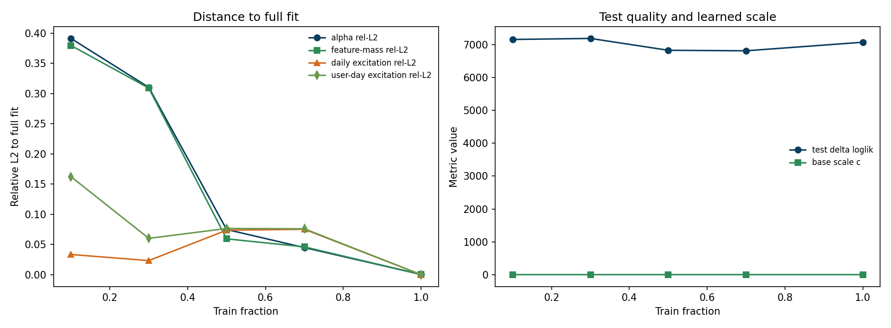
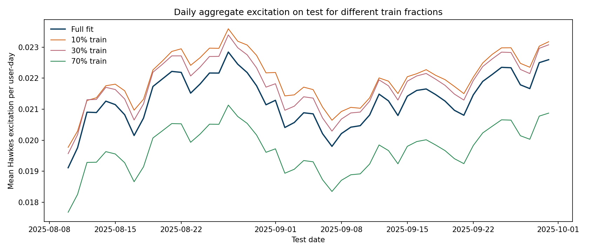
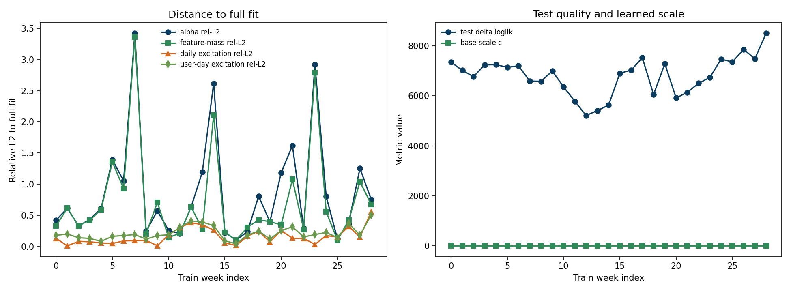
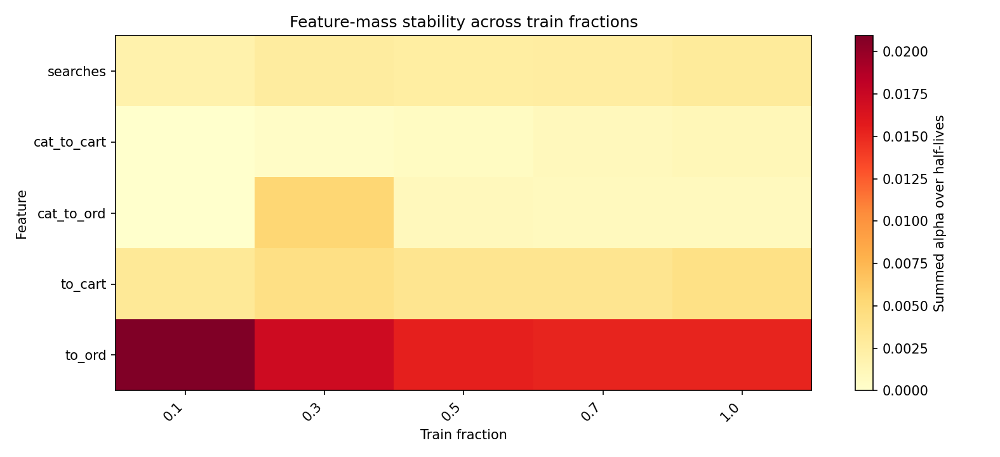
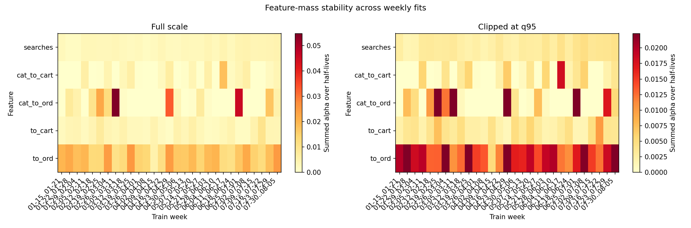

# 07. Исследование устойчивости Hawkes-excitation

## 7.1. Зачем нужен этот эксперимент

После выбора основного Hawkes-базиса `(1,3)` полезно проверить не только итоговые метрики, но и устойчивость самой Hawkes-надстройки.

Вопрос здесь такой:

если модель с half-life `(1,3)` действительно удачна, насколько стабильно она воспроизводит Hawkes-excitation при обучении на сокращенных train-окнах?

Это уже более узкий и более практический вопрос, чем в ранней wide-basis постановке. Теперь нас интересует не столько проблема сильной неидентифицируемости, сколько то, насколько надежно выбранная компактная модель воспроизводит один и тот же excitation-сигнал.

В этой версии анализа акцент делается не на угловом сходстве векторов, а на масштаб-чувствительных характеристиках. Для сильно коррелированного Hawkes-базиса важно видеть не только совпадение формы, но и общий сдвиг уровня, поэтому здесь используются:

1. `relative L2`-расстояния до full-fit;
2. сами daily excitation paths;
3. итоговый `delta_loglik`.

## 7.2. Что именно сравнивается

В качестве reference используется full-train Hawkes-модель из главы 06 с half-life `(1,3)`:

$$
\lambda_{u,t}
=
c \cdot \lambda_{\mathrm{base}}(u,t)
+
\sum_{j=1}^{J}\sum_{m \in \{1,3\}} \alpha_{j,m} z_{u,j,m,t}.
$$

Дальше для prefix-fit и weekly-fit сравниваются четыре объекта:

1. `alpha` — сам вектор коэффициентов;
2. `feature mass` — сумма коэффициентов по двум half-life внутри одной feature;
3. `user-day excitation` — значения
   $$
   e_{u,t} = \sum_{j,m}\alpha_{j,m} z_{u,j,m,t}
   $$
   на всем test;
4. `daily excitation` — среднее значение `e_{u,t}` по всем пользователям внутри каждого test-дня.

Как и в главе 06, здесь используется уже сокращенный набор Hawkes-каналов:

1. `searches`;
2. `cat_to_cart`;
3. `cat_to_ord`;
4. `to_cart`;
5. `to_ord`.

Каналы `search_to_cart` и `search_to_ord` в этот stability-study не включаются, потому что в отдельном pre-check они почти не меняли итоговое качество и в основном лишь перераспределяли веса внутри сильно коррелированного базиса.

То есть эксперимент отвечает на вопрос:

совпадает ли фактическая Hawkes-надстройка, которую модель добавляет к baseline, когда train-окно уменьшается?

## 7.3. Протокол

Протокол совпадает с основным Hawkes-блоком:

1. анализируемое окно: `2025-01-15` -> `2025-09-30`;
2. train: до `2025-08-09`;
3. test: с `2025-08-10` по `2025-09-30`;
4. reference-модель: full-train `scaled-baseline Hawkes` с half-life `(1,3)`.

Reference-fit дает:

1. `base_scale = 0.8262`;
2. `test_delta_poisson_loglik_vs_personalized = +7073.95`.

Код и артефакты:

1. модуль: `src/diploma_experimental/excitation_research.py`;
2. раннер: `scripts/run_experimental_hawkes_excitation_research.py`;
3. summary:
   - `diploma/reports/experimental_hawkes_excitation_research/fraction_excitation_summary.csv`
   - `diploma/reports/experimental_hawkes_excitation_research/weekly_excitation_summary.csv`
4. графики:
   - `diploma/reports/experimental_hawkes_excitation_research/fraction_excitation_similarity.png`
   - `diploma/reports/experimental_hawkes_excitation_research/weekly_excitation_similarity.png`
   - `diploma/reports/experimental_hawkes_excitation_research/fraction_daily_excitation_paths.png`
   - `diploma/reports/experimental_hawkes_excitation_research/fraction_feature_mass_heatmap.png`
   - `diploma/reports/experimental_hawkes_excitation_research/weekly_feature_mass_heatmap.png`

## 7.4. Prefix-study: compact basis сходится быстро

Сначала были обучены те же Hawkes-модели, но только на первых:

1. `10%` train;
2. `30%` train;
3. `50%` train;
4. `70%` train;
5. `100%` train.

Для каждого prefix-fit считались similarity к full reference в четырех пространствах:

1. `alpha`;
2. `feature-mass`;
3. `user-day excitation`;
4. `daily excitation`.

### Краткая таблица

| Train fraction | Alpha rel-L2 | Feature-mass rel-L2 | User-day excitation rel-L2 | Daily excitation rel-L2 | Test `delta_loglik` vs personalized |
| --- | ---: | ---: | ---: | ---: | ---: |
| `0.1` | `0.3911` | `0.3794` | `0.1622` | `0.0334` | `+7158.78` |
| `0.3` | `0.3101` | `0.3088` | `0.0601` | `0.0233` | `+7189.85` |
| `0.5` | `0.0748` | `0.0593` | `0.0764` | `0.0736` | `+6829.18` |
| `0.7` | `0.0448` | `0.0460` | `0.0759` | `0.0751` | `+6813.73` |
| `1.0` | `0.0003` | `0.0004` | `0.0001` | `0.0000` | `+7074.04` |

### Главный вывод по prefix-fit

Здесь картина получается более аккуратной, чем в более мягких similarity-метриках.

Для выбранного compact-базиса `(1,3)`:

1. `daily excitation` действительно близок к full-fit уже на ранних train-фракциях, но не тождественен ему;
2. `user-day excitation` стабилизируется быстрее, чем сами коэффициенты;
3. `alpha` и `feature-mass` по `relative L2` все еще заметно двигаются на коротких префиксах.

То есть после удаления half-life `7` и `21` проблема сильной нестабильности действительно ослабевает, но говорить о почти полном совпадении коэффициентов уже нельзя.

## 7.5. Дневная траектория excitation практически инвариантна

Ниже показана средняя Hawkes-надстройка на test для нескольких prefix-fit:

График подтверждает вывод из таблицы:

1. daily excitation-пути имеют очень похожую форму;
2. но между префиксами все же остается заметный сдвиг уровня;
3. итоговый Hawkes-сигнал как функция времени стабилен скорее по форме, чем по масштабу.

Количественно:

1. `10%` train дает средний уровень daily excitation примерно на `3.3%` выше full-fit;
2. `30%` train — примерно на `2.3%` выше;
3. `70%` train — примерно на `7.5%` ниже.

Следовательно, выбранный Hawkes-базис действительно стабилен, но эта стабильность не абсолютная: небольшие multiplicative shifts по уровню остаются.

## 7.6. Weekly-study: коэффициенты по неделям еще плавают, excitation остается очень устойчивым

Дальше та же логика была проверена на отдельных train-неделях длины `7` дней.

### Сводка по weekly-fit

Средние значения по всем train-неделям:

1. `alpha relative L2 to full = 0.8645` в среднем, `0.6101` по медиане;
2. `feature-mass relative L2 to full = 0.7223` в среднем, `0.4208` по медиане;
3. `half-life mass relative L2 to full = 0.7371` в среднем, `0.4773` по медиане;
4. `user-day excitation relative L2 to full = 0.2126` в среднем, `0.1817` по медиане;
5. `daily excitation relative L2 to full = 0.1589` в среднем, `0.1297` по медиане;
6. `mean test_delta_poisson_loglik_vs_personalized = +6800.18`.

То есть на отдельных неделях:

1. raw коэффициенты все еще могут заметно плавать;
2. но итоговый excitation на test остается очень близким к full-fit;
3. aggregate test quality тоже остается сильным.

### Самый показательный пример

Неделя `2025-03-05 .. 2025-03-11`:

1. `alpha relative L2 to full = 3.4211`;
2. `user-day excitation relative L2 to full = 0.1903`;
3. `daily excitation relative L2 to full = 0.0932`;
4. `test_delta_poisson_loglik_vs_personalized = +6585.84`.

Это хороший пример того, что даже когда конкретные коэффициенты у weekly-fit заметно отличаются, итоговая Hawkes-надстройка на test все равно остается практически той же.

## 7.7. Что устойчиво на самом деле

Отдельно полезно посмотреть на агрегированные массы по feature:

Из этих heatmap следует:

1. feature-level структура у compact-базиса уже достаточно устойчива;
2. instability по неделям сохраняется, но она гораздо слабее, чем в старом wide-basis случае;
3. основная Hawkes-надстройка определяется в первую очередь типом сигнала, а не тонкой декомпозицией на большое число времен памяти.

Для weekly heatmap теперь отдельно показаны:

1. полная шкала, где видно экстремальные недели;
2. clipped-версия без доминирования одного выброса, где становится читаема основная структура.

Иными словами, сокращение числа half-life не только почти не ухудшило метрики, но и сильно улучшило интерпретируемость и устойчивость модели.

## 7.8. Итоговый вывод

Этот эксперимент подтверждает корректность выбора базиса `(1,3)`.

1. Для выбранной Hawkes-модели excitation на test оказывается очень устойчивым.
2. В prefix-study быстрее всего стабилизируется именно сам excitation, а не сырые коэффициенты.
3. В weekly-study raw `alpha` еще могут сильно плавать, но excitation и качество на test остаются заметно более стабильными.
4. Следовательно, сокращение базиса до `(1,3)` действительно убирает значительную часть шума и weak-identifiability, которую давали более длинные half-life.

Практический вывод для дальнейшего рисерча:

1. основной Hawkes-блок разумно строить именно на half-life `(1,3)`;
2. анализировать стоит прежде всего feature-level effects и excitation trajectories;
3. возвращать более длинные half-life имеет смысл только если для этого появится отдельная сильная эмпирическая мотивация.
