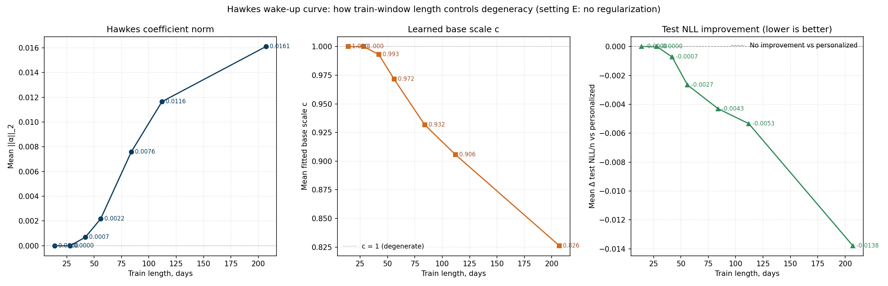

# 11b. Сколько train-данных нужно Hawkes, чтобы не вырождаться

## 11b.1. Постановка вопроса

В главе 10 показано, что на 14-дневном train staged Hawkes вырождается в personalized baseline. Регуляризация в этом не виновата (см. обсуждение в 6b.7 и 10.6) — точка $(c = 1, \alpha = 0)$ является **истинным train-loss оптимумом** на 14-дневном окне в staged-постановке. Это оставляет открытым следующий вопрос: 14 дней — это просто слишком короткое окно, или этот эффект сохраняется на любых разумно коротких train-окнах? На главном split-е (~207 дней train) Hawkes-сигнал есть и устойчив. Где-то между 14 и 207 днями должна быть граница, где он становится статистически различимым.

Эта глава ищет эту границу. Используется тот же CV-протокол, что и в главе 10, но с разной длиной train-окна:

1. одна неделя теста, train ∈ {14, 28, 42, 56, 84, 112} дней;
2. на каждом фиксированном train-длине прогоняется тот же sweep по регуляризации (6 настроек: дефолт, варианты с отключёнными `alpha_l2` / `scale_l2`, полное отсутствие регуляризации, warm-start из решения главы 6);
3. результаты сравниваются с поведением Hawkes на 207-дневном train из главы 6.

## 11b.2. Сразу 4 недели train: всё ещё вырождается

Первая проверка — наивная гипотеза «14 дней просто слишком мало, на 28 уже должно работать».

Протокол: блок 35 дней (28 train + 7 test), 8 непересекающихся блоков на интервале `2025-01-15` ... `2025-10-31`.

Результат: **все 6 настроек × 8 блоков = 48 фитов опять выдают $(c=1, \alpha=0)$ побайтово** (даже warm-start). По агрегированным метрикам:

| Setting | Mean NLL | Mean Δ vs personalized | Mean `c` | Mean $\|\alpha\|_2$ | Доля degenerate |
| --- | ---: | ---: | ---: | ---: | ---: |
| A: default (`1e-4, 10.0`) | `0.36538` | `−1.3e-10` | `1.0000` | `0.0000` | `100%` |
| B: `alpha_l2=0, scale_l2=10` | `0.36538` | `−3.3e-10` | `1.0000` | `0.0000` | `100%` |
| C: `alpha_l2=1e-4, scale_l2=0.1` | `0.36538` | `−5.4e-10` | `1.0000` | `0.0000` | `100%` |
| D: `alpha_l2=1e-4, scale_l2=0` | `0.36538` | `−1.4e-9` | `1.0000` | `0.0000` | `100%` |
| E: no regularization | `0.36538` | `−1.2e-9` | `1.0000` | `0.0000` | `100%` |
| F: warm-start from ch.6, no reg | `0.36538` | `+2.5e-8` | `1.0000` | `0.0000` | `100%` |

То есть удвоение train-окна с 14 до 28 дней не помогает: Hawkes по-прежнему сходится в degenerate point на каждом из 8 блоков, при любой регуляризации, даже стартуя из решения главы 6.

Поэтому имеет смысл не ограничиваться 28 днями, а сделать полный train-length scan.

## 11b.3. Train-length scan: где Hawkes «просыпается»

Для каждого train-длины запускается тот же sweep по регуляризации. Здесь и далее в качестве референса используется **setting E: no regularization** — он самый чистый, потому что отключает оба регуляризатора и убирает их из объяснения. Остальные 5 настроек ведут себя так же и не меняют картину.

| Train (дней) | Train (недель) | Блоков | Mean Δ NLL/n vs personalized | Mean `c` | Mean $\|\alpha\|_2$ | Доля degenerate |
| ---: | ---: | ---: | ---: | ---: | ---: | ---: |
| `14` | `2.0` | `13` | `−6.5e-11` | `1.000` | `0.0000` | `100%` |
| `28` | `4.0` | `8` | `−1.2e-9` | `1.000` | `0.0000` | `100%` |
| `42` | `6.0` | `5` | `−7.2e-4` | `0.993` | `0.0007` | `40%` |
| `56` | `8.0` | `4` | `−2.7e-3` | `0.972` | `0.0022` | `0%` |
| `84` | `12.0` | `3` | `−4.3e-3` | `0.932` | `0.0076` | `0%` |
| `112` | `16.0` | `2` | `−5.3e-3` | `0.906` | `0.0116` | `0%` |
| `207` (chapter 6) | `~29.6` | `1` | `−1.4e-2` | `0.826` | `0.0161` | `0%` |

Картина получается очень чистой:

1. **2–4 недели** (≤ 28 дней): Hawkes полностью degenerate на 100 % блоков. Сигнала нет.
2. **6 недель** (42 дня): первые блоки начинают «просыпаться» — degenerate-доля падает до `40 %`, появляется маленькая ненулевая $\|\alpha\|_2 \approx 0.0007$, и средняя test-NLL улучшается на `~0.0007` ната.
3. **8 недель и больше**: degenerate-доля становится 0 %. Hawkes стабильно находит ненулевые коэффициенты на каждом блоке, и улучшение test-NLL растёт монотонно.
4. **207 дней** (главный split-е из главы 6): ожидаемый «полный» Hawkes-сигнал — `c = 0.826`, $\|\alpha\|_2 = 0.0161$, NLL/n улучшается на `0.0138`.

Иными словами, **порог пробуждения Hawkes-сигнала на этих данных лежит примерно в 5–6 недель train-окна**. До этого порога никакая настройка регуляризации, никакая инициализация и никакие стартовые точки не позволяют оптимизатору найти ненулевую $\alpha$ — её просто нет в данных. После порога Hawkes-сигнал монотонно усиливается с ростом train-окна.

## 11b.4. График

Те же три величины — $\|\alpha\|_2$, фитнутый `c`, средняя Δ test-NLL — как функции от длины train-окна:



Вид у всех трёх кривых согласованный:

1. до `~6` недель — плато на «полностью degenerate» уровне;
2. между `6` и `8` неделями — острый излом, в котором сигнал переключается с нулевого на ненулевой;
3. дальше — плавная монотонная эволюция к «полному» Hawkes-режиму главы 6.

## 11b.5. Что это значит

**Содержательный вывод про данные.**

В этом датасете (10K пользователей, среднее `~0.108` покупок на `user-day`) для проявления статистически устойчивого Hawkes-сигнала нужен train порядка **6–8 недель**. На более коротких окнах нелокальный сигнал «недавняя активность ⇒ покупка завтра» не превышает шум, и оптимум по $\alpha$ сидит ровно на боковой границе $\alpha = 0$ (с учётом non-negativity bound).

**Численный масштаб.**

Среднее число покупок у пользователя за train растёт линейно с длиной окна:
- 14 дней: `~1.5` покупки;
- 28 дней: `~3.0`;
- 42 дня: `~4.5`;
- 56 дней: `~6.0`;
- 84 дня: `~9.0`;
- 207 дней: `~22.4`.

Hawkes требует, чтобы у достаточного числа пользователей в train было хотя бы несколько последовательных покупок, между которыми есть свежий «excitation»-сигнал в `to_ord(hl=3)` или `to_cart(hl=1)`. Похоже, что на этих данных это начинает массово случаться где-то в районе `4–5` покупок на пользователя в train, что соответствует именно `~6` неделям.

**Связь с главой 10.**

В главе 10 был сделан вывод: «Hawkes вырождается в personalized baseline в blockwise CV». Теперь видно, что это **не свойство Hawkes** и **не особенность 14-дневного окна** в отдельности — это свойство **слишком короткого train относительно интенсивности target-сигнала**. Если бы блоки были `8`-недельными или длиннее, Hawkes в CV вёл бы себя качественно так же, как на главном split-е.

**Связь с глобальным выводом про staged-вырождение.**

В главе 10 (и кратко в 6b.7) показано: на 14-дневном окне $(c=1, \alpha=0)$ — это истинный train-loss оптимум при любой регуляризации. Глава 11b уточняет: это поведение сохраняется до ~ 6 недель train, после чего сама задача оптимизации меняет характер — оптимум перестаёт лежать на границе и Hawkes-надстройка начинает приносить пользу. Первопричина — жёсткий in-sample EB-shrinkage в personalized baseline на короткой выборке (детально показано в 10.4.1).

**Связь с production-применением.**

Если производственная система имеет:

1. Только короткое recent-окно (несколько недель истории) — Hawkes-надстройка над personalized baseline ничего не даст, и проще сразу использовать personalized или richer-feature GBDT.
2. Историю порядка квартала и больше — Hawkes начинает вытаскивать осмысленный residual-сигнал поверх personalized.
3. Историю порядка `200`+ дней — получается «полный» Hawkes из главы 6.

## 11b.6. Артефакты и воспроизведение

Все sweep-папки используют один и тот же скрипт с разными параметрами:

```bash
python scripts/run_blockwise_cv_hawkes_reg_sweep.py \
    --block-len 35  --train-len 28  --output-dir diploma/reports/blockwise_cv_hawkes_reg_4w
python scripts/run_blockwise_cv_hawkes_reg_sweep.py \
    --block-len 49  --train-len 42  --output-dir diploma/reports/blockwise_cv_hawkes_reg_6w
python scripts/run_blockwise_cv_hawkes_reg_sweep.py \
    --block-len 63  --train-len 56  --output-dir diploma/reports/blockwise_cv_hawkes_reg_8w
python scripts/run_blockwise_cv_hawkes_reg_sweep.py \
    --block-len 91  --train-len 84  --output-dir diploma/reports/blockwise_cv_hawkes_reg_12w
python scripts/run_blockwise_cv_hawkes_reg_sweep.py \
    --block-len 119 --train-len 112 --output-dir diploma/reports/blockwise_cv_hawkes_reg_16w
python scripts/plot_hawkes_train_length_scan.py
```

Артефакты:

1. отдельные `summary.json` / `cv_reg_sweep_results.csv` в каждой из директорий выше;
2. `diploma/reports/hawkes_train_length_scan/wake_up_curve.csv` — агрегированная таблица;
3. `diploma/reports/hawkes_train_length_scan/wake_up_curve.png` — основной график.

Полный sweep по всем train-длинам выполняется примерно за `2` минуты на текущем датасете. Hawkes-states каждого пользователя строятся в каждом запуске однократно (`~6` секунд), сами фиты при этом стоят `0.2`–`1.0` секунды на блок.
