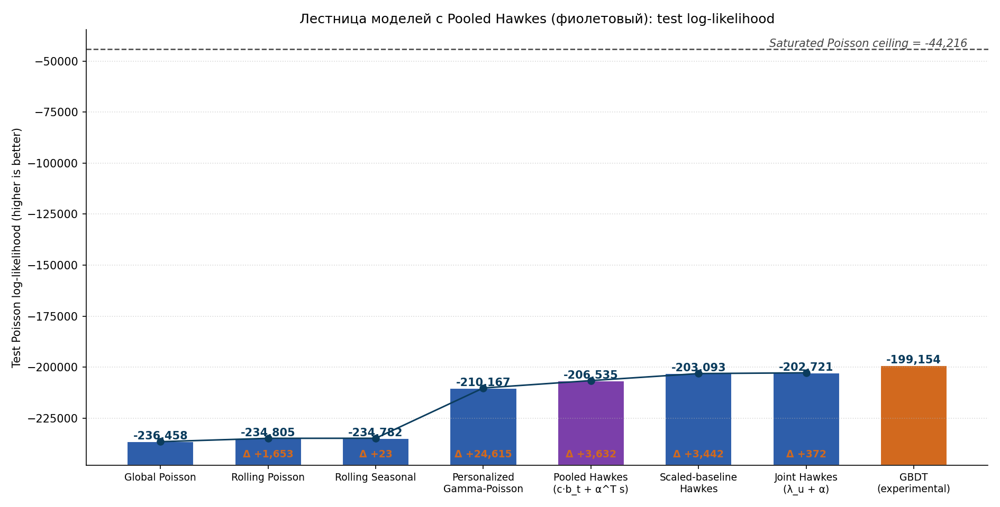
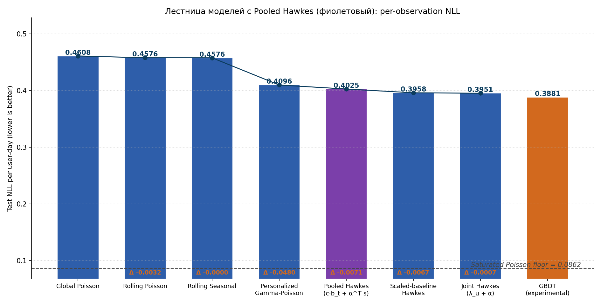
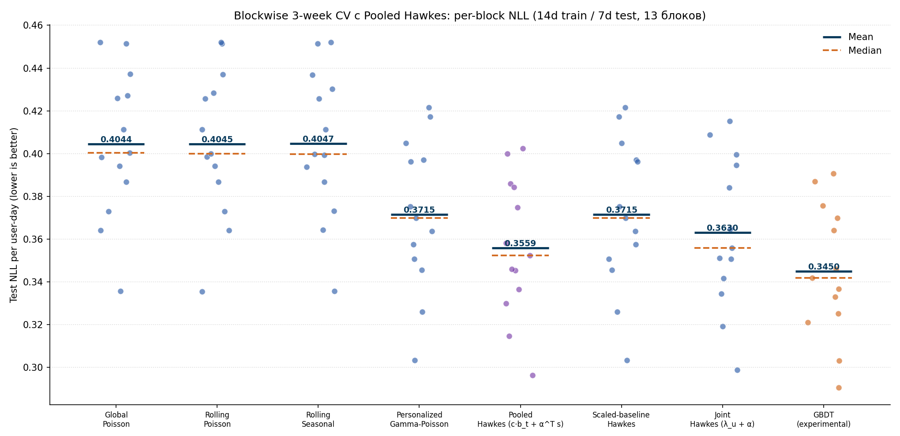

# 12. Pooled Hawkes без per-user multiplier

## 12.1. Постановка

Все предыдущие персонализированные модели имели per-user скаляр `m_u` (либо `μ_u^{EB}`, либо `λ_u`), который умножал rolling-seasonal baseline `b_t`. Hawkes-надстройка `α^⊤ s_{u,t}` шла сверху как поправка.

В этой главе рассматривается противоположный подход: **никакого per-user скаляра не учить вообще**, а всю индивидуальность переложить на Hawkes-состояния. Модель имеет вид

$$
\lambda_{u,t} \;=\; c \cdot b_t \;+\; \alpha^\top s_{u,t},
$$

где

- `c` — **один глобальный скаляр**, общий для всех юзеров;
- `b_t` — rolling-seasonal baseline (зависит только от дня `t`);
- `s_{u,t}` — per-user Hawkes-state vector в день `t`, построенный из exp-decay-сглаженной истории фичей юзера `u` (5 фичей × 2 half-lives = 10 размерностей);
- `α` — **один глобальный** вектор весов размерности 10, общий для всех юзеров.

Итого **11 trainable параметров**. Никаких per-user весов в loss'e — индивидуальность приходит только через `s_{u,t}`, который у каждого юзера свой по построению.

Мотивация модели: на 14d-блоках staged Scaled-baseline Hawkes вырождается в `(c=1, α=0)`, потому что EB-shrunk база `μ_u^{EB} \cdot b_t` уже впитывает per-user сигнал, и под `α ≥ 0` оптимизатор обнуляет `α`. Если убрать per-user multiplier совсем и дать оптимизатору сырой `b_t`, Hawkes-надстройке есть куда работать.

## 12.2. Дизайн обучения

Loss идентичен Hawkes-loss'у из главы 6, но без per-user multiplier:

$$
\mathcal{L}(c, \alpha) \;=\; \sum_{u,t} \left[c \cdot b_t + \alpha^\top s_{u,t} - y_{u,t} \log\!\left(c \cdot b_t + \alpha^\top s_{u,t}\right)\right]
\;+\; \alpha_{l_2} \|\alpha\|_2^2 \;+\; \text{scale}_{l_2} (c - 1)^2.
$$

`α_{l_2} = 1\text{e-}4`, `scale_{l_2} = 10`. Bounds: `c \in [0.001, 50]`, `α_i \in [0, 10]`. Оптимизатор — L-BFGS-B, init `(c=1, α=0.01)`.

Hawkes-states `s_{u,t}` строятся ровно как в главах 6–10: half-lives `(1, 3)` дня, фичи `searches, cat_to_cart, cat_to_ord, to_cart, to_ord`. Кэширование Hawkes-states по полной истории — то же.

## 12.3. Результат на ch.6 protocol (207d train, 52d test)

На длинном train pooled Hawkes обновляет ladder между Personalized Gamma-Poisson и Scaled-baseline Hawkes:





Численная сводка:

| Ступень | Модель | Test `LL` | Test NLL/n | Δ vs предыдущая (LL) |
| ---: | --- | ---: | ---: | ---: |
| 1 | Global Poisson | `-236458` | `0.4608` | — |
| 2 | Rolling Poisson | `-234805` | `0.4576` | `+1653` |
| 3 | Rolling Seasonal | `-234782` | `0.4576` | `+23` |
| 4 | Personalized Gamma-Poisson | `-210167` | `0.4096` | `+24615` |
| 5 | **Pooled Hawkes** (этой главы) | `-206535` | `0.4025` | `+3632` |
| 6 | Scaled-baseline Hawkes | `-203093` | `0.3958` | `+3442` |
| 7 | Joint Hawkes (`λ_u + α`) | `-202721` | `0.3951` | `+372` |
| — | GBDT (experimental) | `-199154` | `0.3881` | — |

Pooled Hawkes на 207d:

- **обыгрывает Personalized Gamma-Poisson** на `+3632` нат / `−0.0071` нат/n. То есть 11 параметров оказываются уже сильнее 10010 параметров EB-модели;
- **проигрывает Scaled-baseline Hawkes** на `−3442` нат / `+0.0067` нат/n. На длинном train per-user `μ_u^{EB}` хорошо оценивается из 200 дней истории и приносит реальную ценность сверх Hawkes-надстройки.

Параметры обученной модели: `c = 0.300`, `‖α‖_2 = 0.079`. То есть базовая компонента сильно занижена (`c · b_t` даёт `~0.30 \cdot 0.10 \approx 0.030` событий/день/юзер), и почти весь сигнал переносится в `α^⊤ s_{u,t}`. На 207d это субоптимально.

## 12.4. Результат на 14d blockwise CV

На коротком train картина переворачивается: pooled Hawkes становится **лучшей вероятностной моделью**, обгоняя в том числе Joint Hawkes:



| Модель | Mean NLL (14d) | # параметров |
| --- | ---: | ---: |
| Global Poisson | `0.4044` | 1 |
| Rolling Poisson | `0.4045` | — (rolling) |
| Rolling Seasonal | `0.4047` | — (rolling) |
| Personalized Gamma-Poisson | `0.3715` | ~10K + 2 |
| **Pooled Hawkes** (этой главы) | **`0.3559`** | **11** |
| Scaled-baseline Hawkes (staged) | `0.3715` | ~10K + 11 |
| Joint Hawkes (`λ_u + α`) | `0.3630` | ~10K + 11 |
| GBDT (experimental) | `0.3450` | (десятки тысяч сплитов) |

Параметры по блокам стабильно одинаковые: `c \in [0.27, 0.33]`, `‖α‖ \in [0.07, 0.09]`. Это **не аномалия одного блока**, а воспроизводимое поведение на всех 13 блоках.

## 12.5. Сравнение режимов

| Сравнение vs Personalized GP | 207d | 14d (mean) |
| --- | ---: | ---: |
| Personalized GP NLL | `0.4096` | `0.3715` |
| Pooled Hawkes NLL | `0.4025` | `0.3559` |
| Δ (Pooled − GP) | `−0.0071` | `−0.0156` |

| Сравнение vs Scaled-baseline Hawkes | 207d | 14d (mean) |
| --- | ---: | ---: |
| Scaled-baseline Hawkes NLL | `0.3958` | `0.3715` |
| Pooled Hawkes NLL | `0.4025` | `0.3559` |
| Δ (Pooled − Scaled) | `+0.0067` | `−0.0156` |

То есть pooled Hawkes — не универсально лучшая модель, а **альтернативная параметризация**, которая выгодна именно на коротких train-окнах, где per-user `μ_u` оценивается ненадёжно. На длинном train адекватно оценённый per-user multiplier добавляет ценность сверх Hawkes-надстройки.

## 12.6. Артефакты

Скрипты:

1. фит на ch.6 (207d): [`scripts/run_pooled_hawkes_ch6.py`](../scripts/run_pooled_hawkes_ch6.py) (`~17` секунд);
2. фит на 14d-блоках: [`scripts/run_staged_on_raw_baseline_14d.py`](../scripts/run_staged_on_raw_baseline_14d.py) (`~2` минуты);
3. рендер графиков главы: [`scripts/run_ch12_pooled_hawkes_plots.py`](../scripts/run_ch12_pooled_hawkes_plots.py) (`<5` секунд).

Артефакты:

1. `diploma/reports/pooled_hawkes_ch6/summary.json` — параметры и test-метрики на 207d;
2. `diploma/reports/blockwise_cv/staged_on_raw_14d.csv` — per-block NLL на 14d CV;
3. `diploma/reports/12_pooled_hawkes/test_loglik_ladder.png` — ladder по LL;
4. `diploma/reports/12_pooled_hawkes/test_nll_per_obs_ladder.png` — ladder по NLL/n;
5. `diploma/reports/12_pooled_hawkes/cv_strip_plot.png` — strip plot 14d CV;
6. `diploma/reports/12_pooled_hawkes/ladder_summary.json`, `cv_summary.json` — числа.

Запуск всего пайплайна главы:

```bash
python scripts/run_pooled_hawkes_ch6.py            # ~17s
python scripts/run_staged_on_raw_baseline_14d.py   # ~2m  (пересобирает per-block CSV)
python scripts/run_ch12_pooled_hawkes_plots.py     # <5s
```
