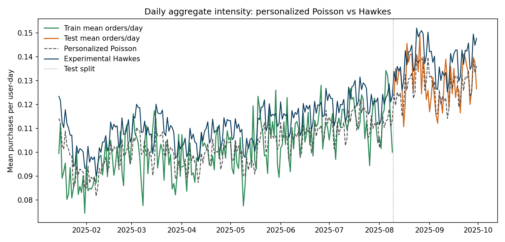

# Experimental 1. Pooled Multi-Kernel Hawkes поверх персонализированного Пуассона

## E1.1. Зачем этот эксперимент

Этот эксперимент не входит в основную лестницу глав и пока не встраивается в базовый дипломный pipeline. Его цель более узкая: быстро проверить, можно ли взять удачную идею Hawkes-модели из соседнего research-пайплайна и прогнать ее на нашем текущем разбиении и на наших метриках.

Источник идеи:

1. локальная reference-note: `diploma/references/dayuses_best_hawkes_model_20260401.md`;
2. текущая локальная реализация: `src/diploma_experimental/hawkes.py`;
3. текущий локальный раннер: `scripts/run_experimental_1_hawkes.py`.

Важно: из соседнего пайплайна здесь взята только идея модели. Train/test-окно, метрики и baseline в этом эксперименте используются наши.

## E1.2. Базовый predictor для Hawkes-надстройки

В качестве baseline здесь берется не простой seasonal Poisson, а сильная модель из главы 4:

$$
\lambda_{\mathrm{base}}(u,t)
=
\hat{\mu}^{\mathrm{post}}_u \cdot \hat{\lambda}^{\mathrm{roll}}_t \cdot \hat{s}_{d(t)}.
$$

То есть Hawkes-компонента должна улучшать уже сильный персонализированный Poisson, а не слабый стартовый baseline.

## E1.3. Идея модели

Проверяем pooled additive multi-kernel Hawkes:

$$
\lambda_{\mathrm{hawkes}}(u,t)
=
\lambda_{\mathrm{base}}(u,t)
+
\sum_{j=1}^{J}\sum_{m=1}^{M} \alpha_{j,m} z_{u,j,m,t}.
$$

Здесь:

1. $j$ пробегает поведенческие признаки;
2. $m$ пробегает набор временных масштабов памяти;
3. $\alpha_{j,m} \ge 0$ это pooled коэффициенты, общие для всех пользователей.

Таким образом, интерпретация модели простая:

1. baseline из главы 4 описывает медленный календарный тренд и устойчивую персональную активность;
2. Hawkes-компонента добавляет краткосрочный триггерный эффект поверх этого baseline.

## E1.4. Состояния Hawkes-ядра

Для признака $j$ и half-life $h_m$ вводится состояние

$$
z_{u,j,m,t}
=
\sum_{\tau < t}
x_{u,j,\tau}\exp\left(-\beta_m (t-\tau)\right),
$$

где

$$
\beta_m = \frac{\ln 2}{h_m}.
$$

Практически используется рекуррентная форма:

$$
z_{u,j,m,t}
=
e^{-\beta_m} z_{u,j,m,t-1}
+
x_{u,j,t-1}.
$$

То есть prediction на день $t$ использует только историю до $t-1`.

## E1.5. Признаки и временные масштабы

В эксперименте использованы те же признаки, которые дали сильный результат в соседнем пайплайне:

1. `searches`;
2. `search_to_cart`;
3. `search_to_ord`;
4. `cat_to_cart`;
5. `cat_to_ord`;
6. `to_cart`;
7. `to_ord`.

Набор half-life:

1. `1` день;
2. `3` дня;
3. `7` дней;
4. `21` день.

Итого получается `7 x 4 = 28` pooled Hawkes-коэффициентов.

## E1.6. Как обучается модель

На train-периоде:

1. фиксируется baseline главы 4;
2. для всех пользователей строятся Hawkes-state vectors;
3. pooled коэффициенты $\alpha_{j,m}$ обучаются по общему пуассоновскому log-likelihood;
4. используется $L_2$-регуляризация:

$$
\mathcal{L}(\alpha)
=
-\log p(y \mid \lambda_{\mathrm{base}} + X\alpha)
+
\lambda_{\mathrm{reg}} \|\alpha\|_2^2.
$$

В текущем эксперименте:

1. `alpha_l2 = 1e-4`;
2. `max_iter = 120`.

## E1.7. Протокол и окно анализа

Используется ровно то же окно, что и в основных главах:

$$
2025\text{-}01\text{-}15 \le t \le 2025\text{-}09\text{-}30.
$$

Split тот же:

1. train: до `2025-08-09`;
2. test: с `2025-08-10` по `2025-09-30`.

Это принципиально важно: эксперимент сравнивается с нашим текущим personalized baseline на одном и том же протоколе.

## E1.8. Реализация

Код этого detour-эксперимента лежит отдельно от основного дипломного pipeline:

1. модель: `src/diploma_experimental/hawkes.py`;
2. plots: `src/diploma_experimental/plots.py`;
3. pipeline: `src/diploma_experimental/pipeline.py`;
4. раннер: `scripts/run_experimental_1_hawkes.py`.

Артефакты:

1. `diploma/reports/experimental_1_hawkes/summary.json`;
2. `diploma/reports/experimental_1_hawkes/daily_aggregate_analysis_window.png`;
3. `diploma/reports/experimental_1_hawkes/alpha_heatmap.png`;
4. `diploma/reports/experimental_1_hawkes/delta_ll_vs_test_purchases_personalized_to_hawkes.png`;
5. `diploma/reports/experimental_1_hawkes/user_ll_gain_hist.png`;
6. `diploma/reports/experimental_1_hawkes/alpha_table.csv`.

## E1.9. Что получилось на данных

Ниже `personalized rolling seasonal Poisson` из главы 4 рассматривается как предыдущая модель, а `experimental Hawkes` как новая модель. В столбце `Delta vs baseline` стоит разность

$$
\text{Hawkes} - \text{personalized Poisson}.
$$

Для `poisson_loglik` большее значение лучше. Для остальных метрик лучше меньшие значения.

### Train

| Metric | Personalized Poisson | Hawkes | Delta vs baseline |
| --- | ---: | ---: | ---: |
| `poisson_loglik` | `-628387.14` | `-625791.23` | `+2595.91` |
| `mean_poisson_nll` | `0.31623` | `0.31492` | `-0.00131` |
| `mean_poisson_deviance` | `0.49387` | `0.49125` | `-0.00261` |
| `MAE` | `0.17606` | `0.18259` | `+0.00653` |
| `RMSE` | `0.55269` | `0.55199` | `-0.00070` |
| `aggregate_bias` | `0.00000` | `0.00917` | `+0.00917` |

### Test

| Metric | Personalized Poisson | Hawkes | Delta vs baseline |
| --- | ---: | ---: | ---: |
| `poisson_loglik` | `-210167.01` | `-205821.72` | `+4345.29` |
| `mean_poisson_nll` | `0.40959` | `0.40112` | `-0.00847` |
| `mean_poisson_deviance` | `0.64683` | `0.62990` | `-0.01694` |
| `MAE` | `0.21870` | `0.22591` | `+0.00721` |
| `RMSE` | `0.63140` | `0.63011` | `-0.00129` |
| `aggregate_bias` | `-0.00169` | `0.00915` | `+0.01084` |
| `relative_aggregate_bias` | `-1.30%` | `+7.07%` | `+8.37 pp` |

То есть Hawkes действительно улучшает likelihood-метрики даже поверх сильного baseline главы 4, но делает это ценой ухудшения `MAE` и заметного роста положительного bias.

## E1.10. Дневная динамика

По графику видно, что Hawkes систематически поднимает интенсивность относительно personalized Poisson. Это помогает по likelihood, но одновременно приводит к заметному положительному bias:

1. у baseline `aggregate_bias = -0.00169`;
2. у Hawkes `aggregate_bias = +0.00915`.

То есть модель становится более агрессивной и склонной к перепредсказанию.

## E1.11. Какие сигналы реально использовались

Оцененные pooled коэффициенты:

Главное наблюдение: почти весь полезный сигнал сидит в очень короткой памяти.

1. почти все ненулевые коэффициенты относятся к half-life `1` день;
2. half-life `3` дня остается только у `cat_to_ord`, и то очень слабо;
3. half-life `7` и `21` дней модель фактически занулила.

Наиболее сильные коэффициенты:

1. `to_ord, hl=1`: `0.00620`;
2. `search_to_ord, hl=1`: `0.00585`;
3. `to_cart, hl=1`: `0.00230`.

Это означает, что в текущем окне Hawkes полезен прежде всего как модель очень краткосрочного trigger effect, а не как длинная память на недели.

## E1.12. Где Hawkes выигрывает и проигрывает

Подробное user-level сравнение `personalized Poisson -> Hawkes` вынесено в отдельный файл:

1. `diploma/experimental_model_compare.md`

Это сделано специально, чтобы не смешивать описание самой модели и сравнение experimental-кандидатов с текущим сильным baseline.

## E1.13. Вывод

Этот быстрый эксперимент оказался полезным.

1. Идея pooled additive multi-kernel Hawkes переносится на наш текущий протокол и действительно дает прирост по likelihood даже поверх сильного personalized Poisson.
2. Однако этот прирост не универсален: user-level improvement получают далеко не все пользователи.
3. Модель оказывается полезной в основном для пользователей с более насыщенной test-активностью.
4. Почти весь Hawkes-сигнал лежит в короткой памяти порядка одного дня.
5. По `MAE` Hawkes хуже персонализированного Пуассона, так что назвать его безусловно лучшей моделью пока нельзя.

Иными словами, это не “серебряная пуля”, но уже очень хороший кандидат на отдельный исследовательский блок диплома: у модели есть интерпретируемая структура, заметный likelihood gain и понятные границы применимости.
