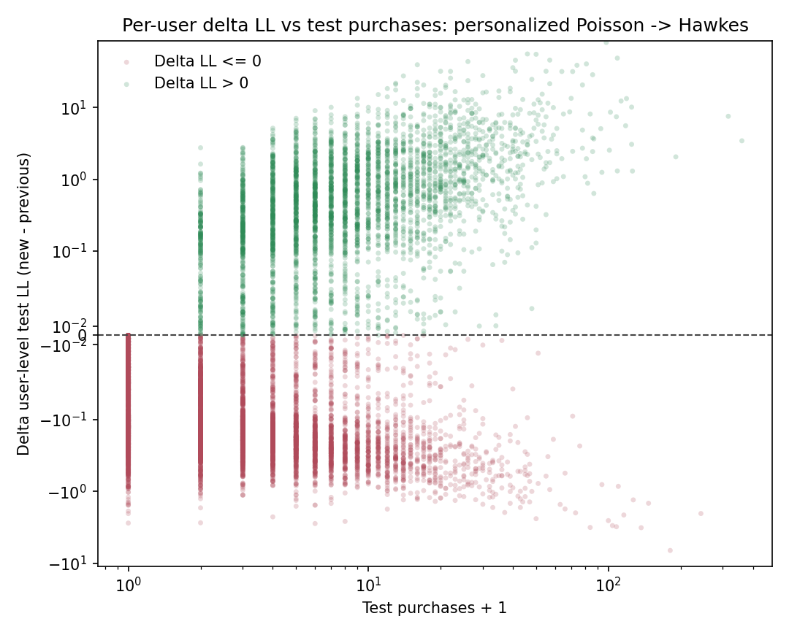
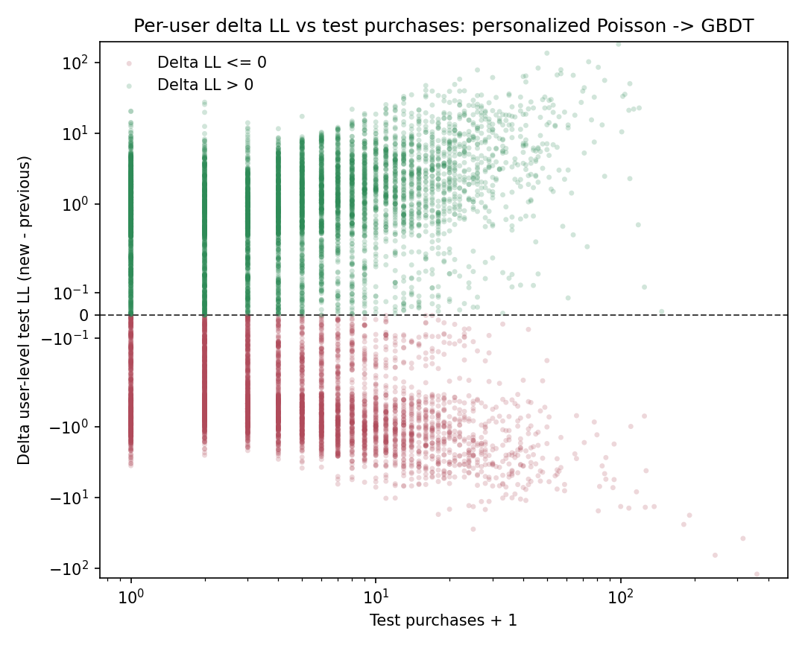

# Experimental Model Compare

Этот файл собирает сравнения experimental-моделей с текущим сильным baseline:

$$
\lambda_{\mathrm{base}}(u,t)
=
\hat{\mu}^{\mathrm{post}}_u \cdot \hat{\lambda}^{\mathrm{roll}}_t \cdot \hat{s}_{d(t)}.
$$

То есть здесь сравниваются не главы основной лестницы моделей между собой, а отдельные detour-эксперименты против `personalized rolling seasonal Poisson`.

## Experimental 1: personalized Poisson -> pooled multi-kernel Hawkes

Полное описание самой Hawkes-модели находится в `diploma/experimental_1_hawkes_model.md`. Здесь фиксируется только пользовательская структура выигрыша.

Рассматривается величина

$$
\Delta \mathrm{LL}_u
=
\mathrm{LL}_u^{\mathrm{hawkes}}
-
\mathrm{LL}_u^{\mathrm{personalized}}.
$$

Сводка:

1. `share(new > prev) = 36.1%`;
2. `mean_delta_ll = +0.4378`;
3. `median_delta_ll = -0.0614`;
4. `q10_delta_ll = -0.3525`;
5. `q90_delta_ll = +1.3211`.

По структуре этот переход гораздо ближе к `global Poisson -> rolling Poisson`, чем к `rolling seasonal -> personalized`:

1. aggregate likelihood растет;
2. но положительный эффект получают далеко не все пользователи;
3. выигрыш снова концентрируется в более активных сегментах.

По бакетам `test purchases`:

1. `0` покупок: `share(new > prev) = 0.0%`, `mean_delta_ll = -0.1316`;
2. `1` покупка: `13.7%`, `mean_delta_ll = -0.1101`;
3. `2` покупки: `27.9%`, `mean_delta_ll = -0.0296`;
4. `3-5` покупок: `42.3%`, `mean_delta_ll = +0.1894`;
5. `6-10` покупок: `55.7%`, `mean_delta_ll = +0.5083`;
6. `11+` покупок: `66.7%`, `mean_delta_ll = +1.9264`.

Вывод:

1. Hawkes поверх сильного personalized Poisson не является универсальным улучшением всей панели.
2. Его основной выигрыш находится у пользователей с более насыщенной событийной историей в test.
3. Для low-activity сегментов personalized Poisson чаще остается более устойчивым baseline.

## Experimental 2: personalized Poisson -> global Poisson GBDT

Полное описание самой GBDT-модели находится в `diploma/experimental_2_gbdt_model.md`. Здесь фиксируется только пользовательская структура выигрыша.

Рассматривается величина

$$
\Delta \mathrm{LL}_u
=
\mathrm{LL}_u^{\mathrm{gbdt}}
-
\mathrm{LL}_u^{\mathrm{personalized}}.
$$

Сводка:

1. `share(new > prev) = 56.5%`;
2. `mean_delta_ll = +1.1095`;
3. `median_delta_ll = +0.1827`;
4. `q10_delta_ll = -1.1332`;
5. `q90_delta_ll = +3.7507`.

Структура этого перехода заметно лучше, чем у Hawkes:

1. aggregate likelihood растет сильнее;
2. положительный эффект получает уже большинство пользователей;
3. выигрыш распределен по панели более равномерно, хотя у heavy users он по-прежнему больше.

По бакетам `test purchases`:

1. `0` покупок: `share(new > prev) = 63.8%`, `mean_delta_ll = +0.7064`;
2. `1` покупка: `47.4%`, `mean_delta_ll = +0.3415`;
3. `2` покупки: `53.2%`, `mean_delta_ll = +0.3502`;
4. `3-5` покупок: `57.6%`, `mean_delta_ll = +0.7291`;
5. `6-10` покупок: `55.7%`, `mean_delta_ll = +1.0696`;
6. `11+` покупок: `57.9%`, `mean_delta_ll = +3.0608`.

Вывод:

1. GBDT поверх personalized Poisson дает не локальный, а уже массовый user-level improvement.
2. В отличие от Hawkes, модель выигрывает даже у сегмента с `0` покупок в test.
3. Это еще один аргумент в пользу того, что богатые day-level history-features сейчас описывают остаточную структуру данных лучше, чем чистая self-excitation надстройка.
