<!-- _class: lead -->

# Применимость процессов Хокса для предсказания пользовательской активности в e-commerce

**Алексей Мошкин**
МКН СПбГУ, 2026

Научный руководитель: Николаев Максим Сергеевич

<!--
Это предзащита моей дипломной работы. Расскажу постановку, основные модели, и где Hawkes-процессы дают реальный выигрыш, а где — нет.
-->

---

## Цель работы

Исследовать границы применимости процессов Хокса для предсказания дневной интенсивности покупок пользователя в e-commerce.

Подзадачи:

1. Построить иерархию статистических моделей для устойчивого бейзлайна под Hawkes-добавку.
2. Исследовать особенности сходимости Hawkes-коэффициентов: сколько данных нужно, чтобы коэффициенты сошлись.
3. Исследовать кросс-Hawkes матрицу зависимостей между каналами воронки.
4. Сравнить Hawkes-модель с двумя явными бейзлайнами: статистической пуассоновской моделью и бустингом.

<!--
Главный вопрос работы — не просто "лучший скор", а понимание структурно: при каких длинах train разные параметризации Hawkes выигрывают.
-->

---

## Hawkes-процессы: базовое определение

Self-exciting point process — интенсивность зависит от истории своих событий:

$$
\lambda(t) = \mu + \sum_{t_i < t} \alpha \cdot \exp\!\left(-\beta (t - t_i)\right).
$$

В дискретно-дневной форме для юзера `u`:

$$
\lambda_{u,t} = \mu + \sum_{j} \alpha_j \cdot z_{u,j,t},
$$

где:

- `z_{u,j,t}` — экспоненциально сглаженный счётчик `j`-ой фичи для покупателя `u` до дня `t`;
- `α_j` — Hawkes-веса.

<!--
Главное: каждое событие пользователя экспоненциально "поджигает" будущую интенсивность. Half-lives задают временные масштабы памяти — у нас 1 и 3 дня.
-->

---

<!-- _class: tight -->

## Данные

- `~10K` пользователей × `~290` дней (`2025-01-15` → `2025-10-31`).
- 5 поведенческих счётчиков на `(user, day)`: `searches`, `cat_to_cart`, `cat_to_ord`, `to_cart`, `to_ord` — target = `to_ord`.

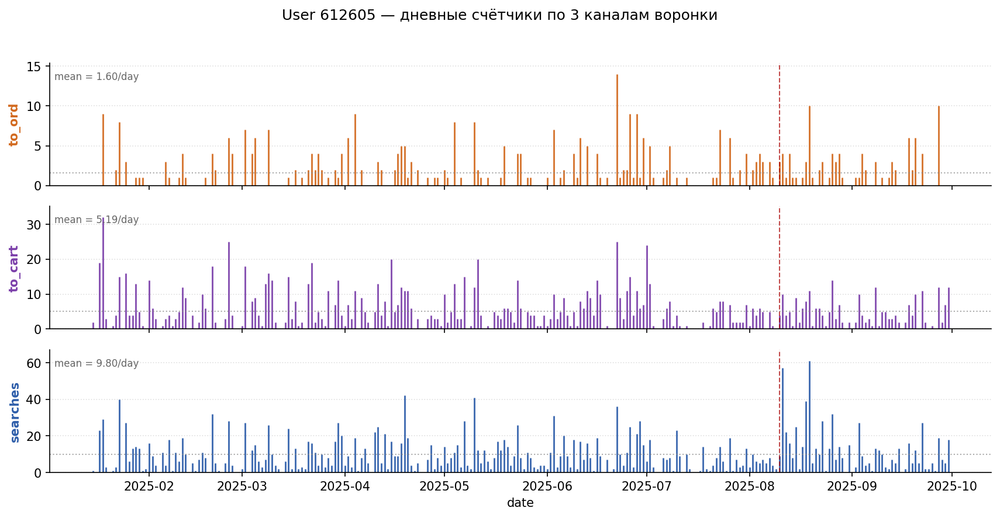

<!--
Один пользователь (612605), три канала воронки: to_ord ≈ 1.6/день, to_cart ≈ 5.2/день, searches ≈ 9.8/день. Видно структуру воронки в счётчиках одного юзера: чем дальше по воронке, тем меньше событий, и тем разреженнее. Красная пунктирная — граница train/test.
-->

---

## Распределение числа покупок на user-day

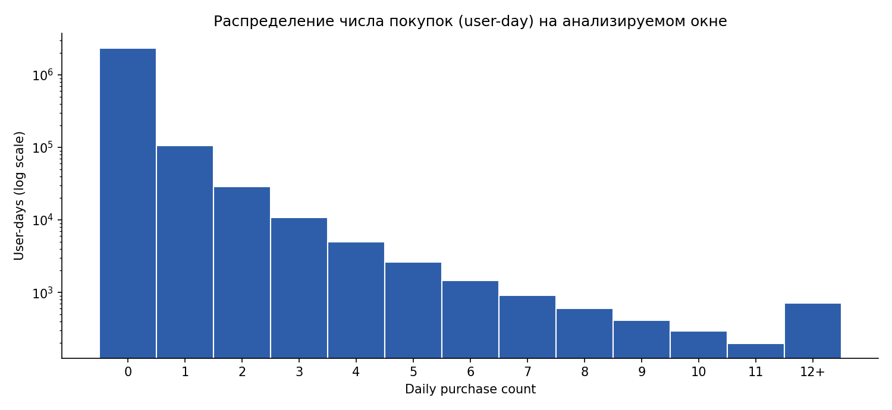

- `93.7%` user-days — нули.
- Тяжёлый правый хвост: единичные `(user, day)` с десятком покупок и больше.
- `18%` самых активных юзеров делают `62%` всех покупок.

<!--
Лог-шкала по Y нужна, чтобы одновременно увидеть колоссальную долю нулей и редкий правый хвост.
-->

---

## Дневная интенсивность на полном ряду

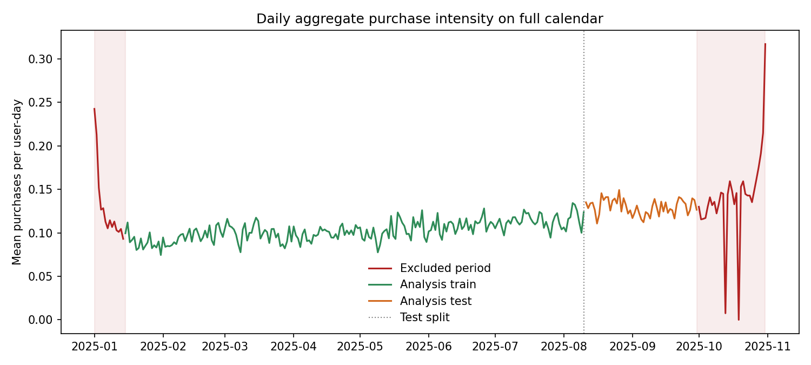

Видно три режима:

1. первые две недели января — аномально высокая активность (NY-промо/подарки);
2. середина января → конец сентября — основное стабильное окно;
3. октябрь — снова повышенный уровень.

<!--
Анализируемое окно фиксировано во всех экспериментах, чтобы NY-всплеск не путался с настоящим signal'ом. Анализируемое окно — 2025-01-15 .. 2025-10-31 (для гл.10–11 включая октябрь, для гл.9 без него).
-->

---

## Что мы предсказываем и метрика качества

Для каждой пары `(user, day)` оцениваем интенсивность `λ_{u,t}`:

$$
y_{u,t} \mid \lambda_{u,t} \sim \mathrm{Poisson}(\lambda_{u,t}).
$$

Метрика — mean Poisson NLL на тесте:

$$
\mathrm{NLL} = \frac{1}{N} \sum_{u,t} \left[ \lambda_{u,t} - y_{u,t} \log \lambda_{u,t} + \log y_{u,t}! \right].
$$

Минимум NLL ≠ 0 — saturated Poisson floor ≈ `0.086`: даже идеальная модель не закроет всю aleatoric uncertainty.

Дополнительно для диагностики:

$$
\mathrm{MAE} = \frac{1}{N} \sum_{u,t} |y_{u,t} - \hat\lambda_{u,t}|, \qquad
\mathrm{RMSE} = \sqrt{\frac{1}{N} \sum_{u,t} (y_{u,t} - \hat\lambda_{u,t})^2}.
$$

<!--
NLL естественна для счётных данных и согласуется с модельным предположением. Saturated floor показывает теоретический предел снизу.
-->

---

## Построение бейзлайна

Напомню форму Hawkes-процесса:

$$
\lambda_{u,t} \;=\; \underbrace{\mu_{u,t}}_{\text{baseline}} \;+\; \sum_{j} \alpha_j \cdot z_{u,j,t}
$$

`μ_{u,t}` — то, что нужно сначала надёжно оценить, чтобы Hawkes-надстройка училась на остатке.

План построения бейзлайна:

1. Global Poisson — константа `λ̄` на всю панель.
2. Rolling Poisson — скользящий средний дневного уровня.
3. Rolling Seasonal — + поправка на день недели.
4. Personalized Gamma-Poisson — индивидуальная интенсивность отдельных пользователей через Байесовский вывод при предположении, что prior распределение — Gamma-распределение.

<!--
Шаги 1–3 ловят общий level и сезонность; основной шаг — персонализация на 4-м, она и даёт самый большой выигрыш по NLL.
-->

---

## Rolling baseline: динамика уровня

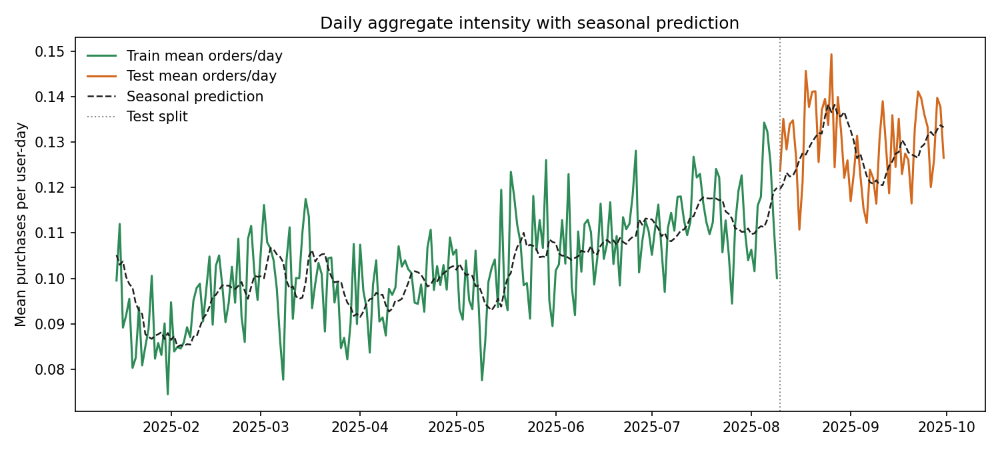

Видно, что стоит попробовать идеи rolling и недельной сезонности.

<!--
Глобальный Poisson сильно недооценивает уровень test-периода (~0.103 vs 0.130). Rolling baseline почти полностью убирает aggregate bias и за счёт этого заметно выигрывает в log-likelihood.
-->

---

## Personalized Gamma-Poisson — Empirical Bayes

Модель: `y_{u,t} ~ Poisson(μ_u · b_t)`, `μ_u ~ Gamma(α, β)`.

Posterior:
$$
\hat\mu_u^{\mathrm{EB}} = \frac{\alpha + Y_u}{\beta + E_u}.
$$

`(α, β) ≈ (0.88, 0.88)` оцениваются marginal MLE'ем по `(Y_u, E_u)` пары пар.

<!--
Это самая мощная "простая" модель. Дальше любые улучшения идут уже только на её фоне. Малоактивные юзеры тянутся к α/β ≈ 1, активные — к raw MLE; без shrinkage NLL = 0.4650 против EB 0.4096.
-->

---

## Per-observation NLL: лестница базовых моделей

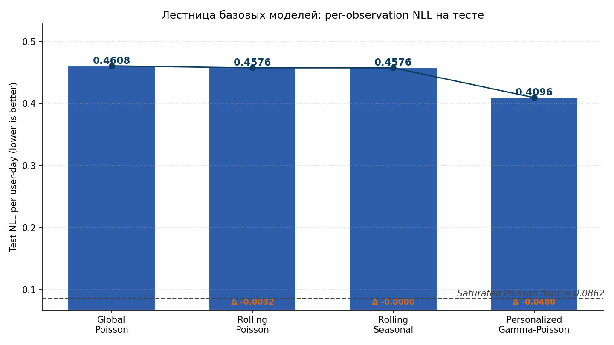

Самый крупный шаг — персонализация (`+24K` нат LL); уровень и сезонность дают по чуть-чуть.

<!--
Saturated Poisson floor ≈ 0.0862. Шаги global → rolling → seasonal — практически плато; следующий шаг (персонализация) даёт уже большой gap. Дальше будет ещё одна ступень — Hawkes.
-->

---

<!-- _class: tight -->

## Переход глава 3 → глава 4: per-user delta-LL

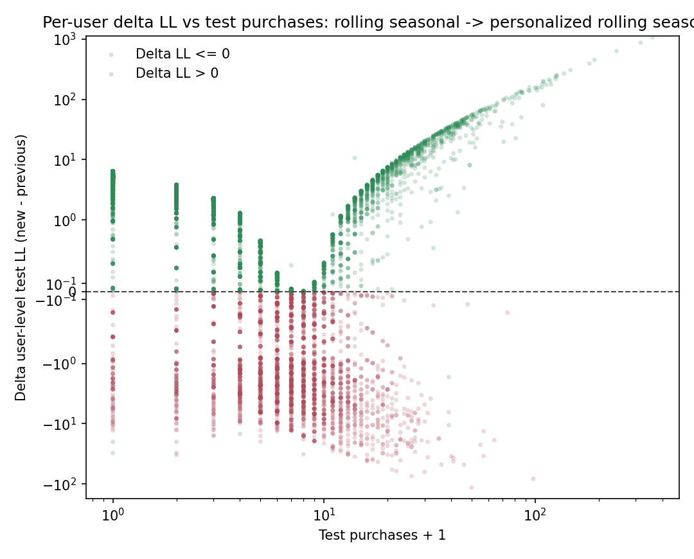

- `share(personalized > rolling seasonal) = 66%`;
- юзеры с `0..2` покупок выигрывают почти всегда (`87..94%`);
- бакет `6..10` покупок — наоборот, проигрывает (`18%`): shrinkage тянет слишком сильно;
- `11+` снова выигрывает за счёт `μ_u`.

<!--
Эта диагностика показывает, что улучшения от персонализации распределены неоднородно. Это будет важно ниже — Hawkes-надстройка будет работать поверх этой персонализации.
-->

---

## Hawkes-процессы: базовое определение

Self-exciting point process — интенсивность зависит от истории своих событий:

$$
\lambda(t) = \mu + \sum_{t_i < t} \alpha \cdot \exp\!\left(-\beta (t - t_i)\right).
$$

В дискретно-дневной форме для юзера `u`:

$$
\lambda_{u,t} = \mu + \sum_{j} \alpha_j \cdot z_{u,j,t},
$$

где:

- `z_{u,j,t}` — экспоненциально сглаженный счётчик `j`-ой фичи для покупателя `u` до дня `t`;
- `α_j` — Hawkes-веса.

<!--
Главное: каждое событие пользователя экспоненциально "поджигает" будущую интенсивность. Half-lives задают временные масштабы памяти — у нас 1 и 3 дня.
-->

---

## Анализ фичей: матрица корреляций

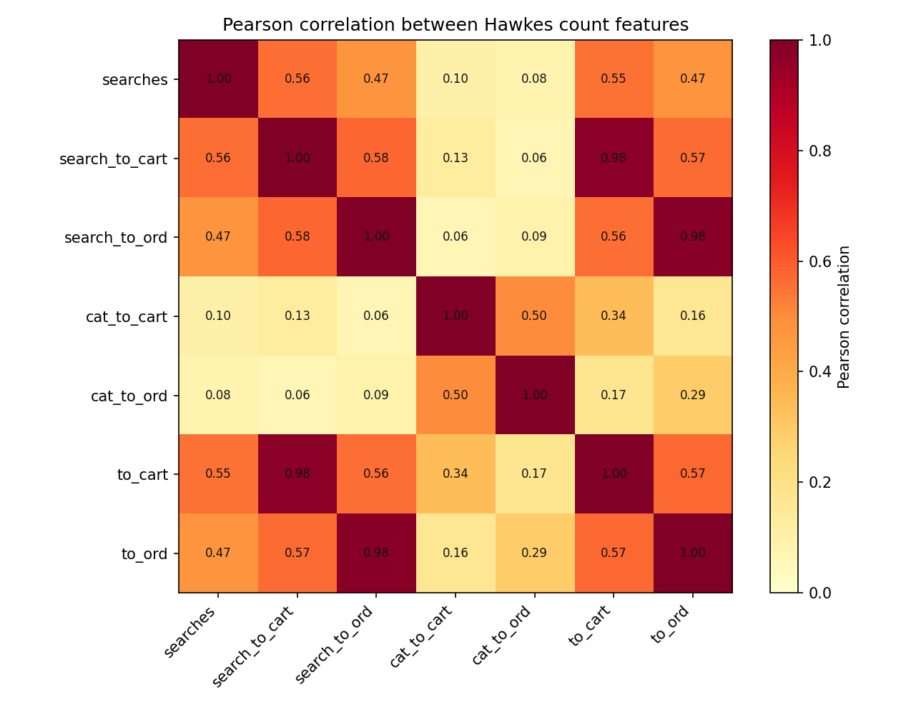

Каналы `search_to_cart` и `search_to_ord` сильно скоррелированы с `to_cart` и `to_ord` (`r > 0.9`).

→ исключены из основной Hawkes-модели; остаётся 5 фичей вместо 7.

<!--
Это снижает collinearity в Hawkes-states и упрощает интерпретацию α-матрицы.
-->

---

## Scaled-baseline Hawkes (глава 6): модель и обучение

$$
\lambda_{u,t} = c \cdot \mu_u^{\mathrm{EB}} \cdot b_t + \sum_{j,m} \alpha_{j,m} \, z_{u,j,m,t}.
$$

- baseline `μ_u^{EB} · b_t` зафиксирован (Personalized GP из гл.4);
- 5 фичей × 2 half-life `(1, 3)` дня → `10` параметров `α` + `1` глобальный `c`.

Loss (регуляризованный Poisson NLL на train):

$$
\mathcal{L}(c,\alpha) = -\log p\!\left(y \mid c\lambda_{\mathrm{base}} + X\alpha\right) + \lambda_\alpha \|\alpha\|_2^2 + \lambda_c (c-1)^2.
$$

Обучение: сначала EB (гл.4) → потом численными методами по `(c, α)` с `α ≥ 0`. В разделе 6.10 показано, что результат не зависит от выбора `λ_α, λ_c` в широком диапазоне.

<!--
Регуляризация на 11 параметрах при ~2M user-day на train не нужна почти ни в каком виде. Этот результат явно подтверждён сетками в гл.6.10.
-->

---

## Scaled-baseline Hawkes: результаты

| Метрика | Pers. GP | Scaled Hawkes | Δ |
| --- | ---: | ---: | ---: |
| Test NLL | `0.4096` | `0.3958` | `−0.0138` |
| Test `LL` | `−210167` | `−203093` | `+7074` |
| `MAE` | `0.2187` | `0.2169` | `−0.0018` |
| `RMSE` | `0.6314` | `0.6272` | `−0.0042` |

Обученные параметры:
`ĉ = 0.83`, `‖α‖₂ = 0.016`.

Основной сигнал — `to_ord (hl=3)`, плюс `searches`, `to_cart` на коротких масштабах.

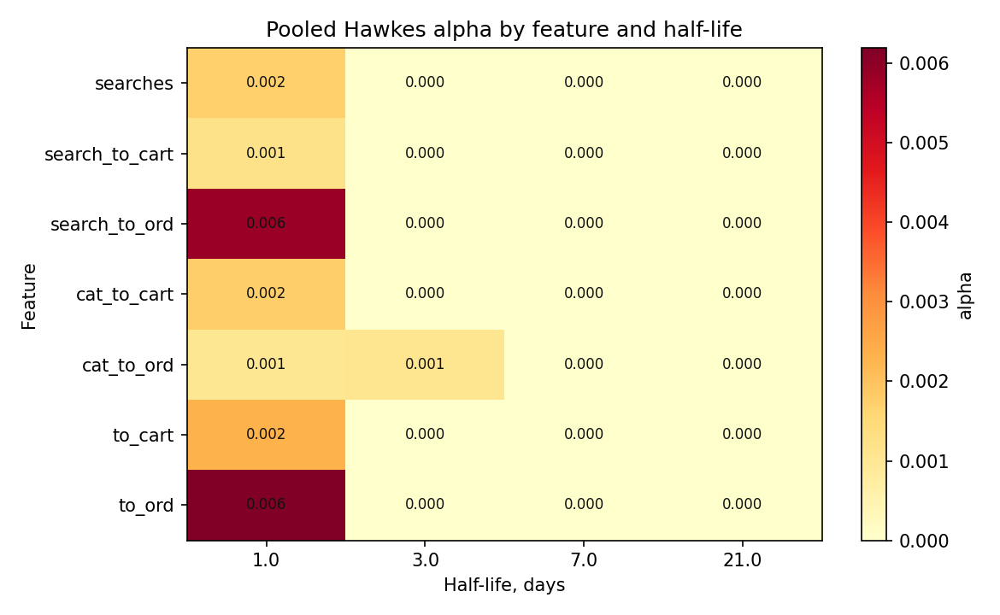

<!--
Hawkes даёт устойчивое улучшение, но не радикальное. Модель чуть занижает baseline (c ≈ 0.83) и компенсирует Hawkes-надстройкой.
-->

---

## Scaled-baseline Hawkes: per-user delta-LL

- `share(Hawkes > Personalized GP) = 63.4%`;
- mean / median delta-LL: `+0.71` / `+0.16`;
- по бакетам `0..11+` покупок Hawkes выигрывает у `54..80%` юзеров — gain массовый, а не локальный.

<!--
Это второй критичный момент: в отличие от перехода 3→4 здесь нет явных проигрывающих бакетов — Hawkes-надстройка работает поверх уже выровненного persoanlized baseline'a.
-->

---

## Tree-based подход и trade-off

GBDT (HistGradientBoostingRegressor, Poisson loss) на расширенном feature-engineering — всего `141` фича, 5 групп:

- календарь (`dow`, `days_seen`, `week_idx`);
- history по 14 исходным сигналам: `*_yesterday`, `*_sum3/7`, `*_mean7`, `*_active_days7`, `*_exp3`, `*_last_active`, `*_days_since_last_active`;
- EMA: `*_ewm7`, `*_ewm28`, `*_ewm_gap_7_28` для `to_ord`, `to_cart`, `any_activity`;
- общие агрегаты по заказам и активности (`orders_hist_mean`, `carts_hist_mean`, …);
- recency и funnel-ratio: `days_since_last_*`, `ord_per_cart_7`, `*_rate_7`.

Test NLL `0.3881` — лучше всех Hawkes-моделей (`+3K..7K` нат). Но нет интерпретируемости: какие фичи когда работают.

Trade-off: GBDT — лучший скор, Hawkes — структурное понимание `(c, μ_u, α)`. В дипломе GBDT отмечен отдельным цветом — reference point, а не research-линия.

<!--
Деревья — апельсины к нашим яблокам. Они хорошо ловят нелинейные взаимодействия, но не дают про per-user интенсивность ничего интерпретируемого.
-->

---

## Лестница моделей (глава 9)

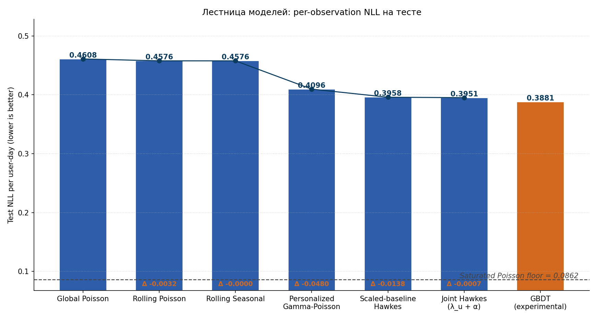

`−0.048` NLL от персонализации, `−0.014` от Hawkes-надстройки, `−0.001` от joint vs staged. GBDT — отдельная ветка.

<!--
Главный вывод этой картинки: основной выигрыш — персонализация. Hawkes — заметная, но скромная добавка относительно EB.
-->

---

## Переход к другим train-test (глава 10)

Blockwise CV: `13` непересекающихся `21d`-блоков, каждый = `14d train + 7d test`.

На коротких train (14d) Joint Hawkes слегка опережает Personalized GP и Scaled-baseline — Hawkes-сигнал ещё ловится, GBDT остаётся лучшим в абсолюте.

<!--
Главное наблюдение: Scaled-baseline Hawkes на 14d ВЫРОЖДАЕТСЯ в Personalized GP (c=1, α=0). EB-shrunk база коллинеарна Hawkes-сигналу. На длинных train этой проблемы нет.
-->

---

## Новый Hawkes-вариант (глава 8)

Идея: вероятно Scaled-baseline Hawkes вырождается, потому что с помощью множителя на базовую интенсивность мы уже обучаемся под редкие `to_ord`-события на 14d. Нужно попробовать другую форму обучения и другую регуляризацию.

Joint Hawkes: `λ_u` и `α` обучаются одновременно с регуляризацией `(λ_u − 1)²`.

$$
\lambda_{u,t} = \lambda_u \cdot b_t + \alpha^\top s_{u,t}.
$$

Нет двухступенчатости как у Scaled-baseline.

<!--
Идея Joint: не фиксировать μ_u до Hawkes-fit'а — позволить им договариваться между собой.
-->

---

## Train-length scan (глава 11)

Sweep по `n` от `15` до `198` дней; `m` случайных интервалов на каждое `n`; `2n/3` train + `n/3` test.

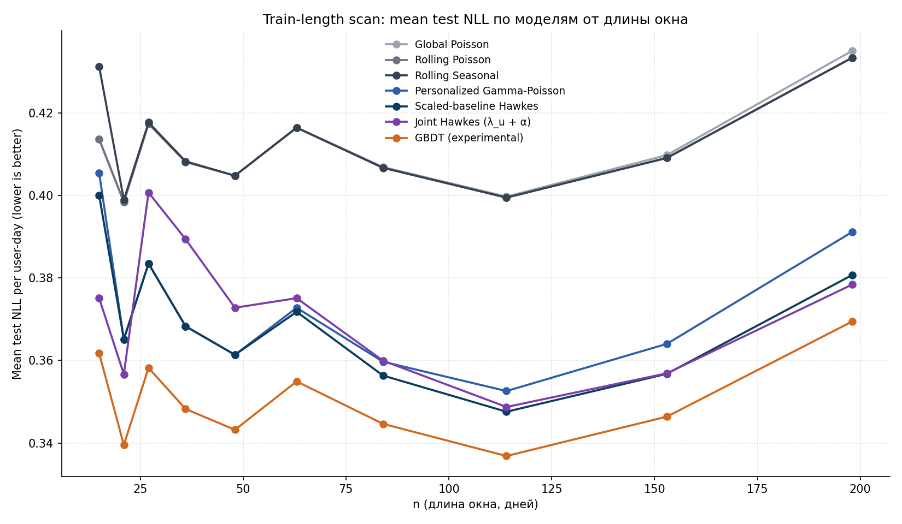

Crossover'ы:

- `n ≤ 21`: **Joint Hawkes** опережает Scaled и Personalized GP.
- `n ∈ [27, 60]`: Personalized GP, Scaled и Joint сходятся.
- `n ≥ 100`: **Scaled-baseline Hawkes** ≈ **Joint Hawkes** ≈ best probabilistic.

<!--
Это самый ёмкий результат работы. Видно, что нет "универсально лучшей" Hawkes-модели — выбор зависит от длины train.
-->

---

## Per-run NLL по моделям для каждого `n`

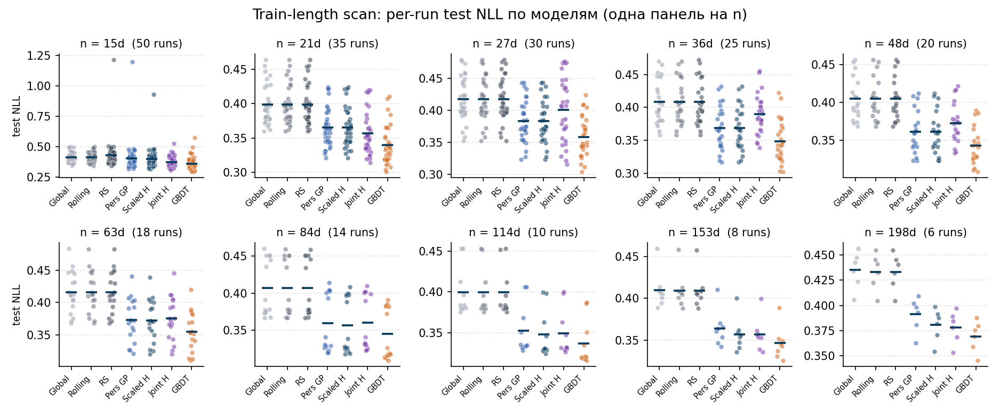

Каждая панель — одно значение `n`; точки — отдельные подвыборки, синяя черта — среднее.

<!--
То же самое, но без усреднения: видно дисперсию по подвыборкам и стабильность ранжирования моделей внутри каждого n.
-->

---

## Поведение Hawkes-параметров от длины train

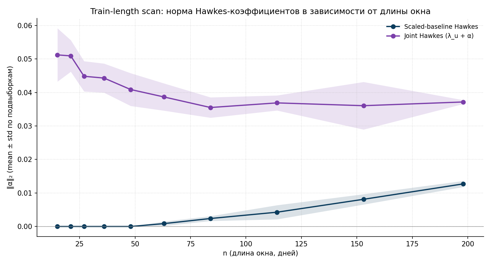 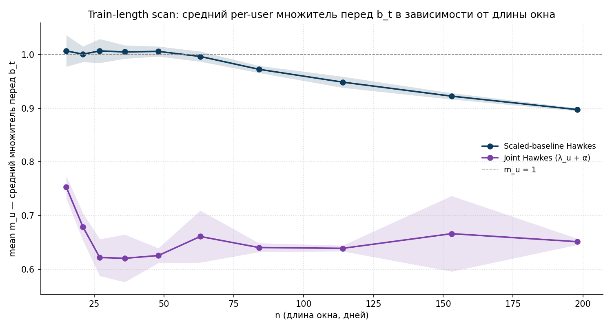

- Scaled-baseline: до `n ≈ 50` — `‖α‖ = 0`, `c = 1`. Полное вырождение.
- Joint: `‖α‖ ≈ 0.04..0.05` — стабильный сигнал на всех `n`.

<!--
Левый график — норма Hawkes-коэффициентов; правый — средний per-user множитель перед b_t. На коротких train у staged Hawkes регуляризация не виновата, а EB-база впитывает Hawkes-сигнал.
-->

---

<!-- _class: lead -->

# Исследование структуры Hawkes-ядер

<!--
Дальше — отдельный исследовательский блок: cross-channel матрица α, её bootstrap-стабильность, чувствительность к регуляризации и profile likelihood по 9 коэффициентам.
-->

---

<!-- _class: tight -->

## Что учим и как теперь смотрим на параметры

Joint Hawkes на одну целевую серию:

$$
\lambda_u(t) \;=\; \lambda_u \cdot b_t \;+\; \alpha^\top z_u(t)
$$

- `λ_u` — per-user multiplier (L2-prior к `1`)
- `b_t` — общий baseline дневной профиль
- `α` — Hawkes-веса по каналам-источникам

Раньше: один target `to_ord`, `α` — вектор по 3 источникам.
Теперь: 3 target'а × 3 source'а = матрица `α ∈ ℝ^{3×3}` всех cross-channel взаимодействий воронки `searches → to_cart → to_ord`.

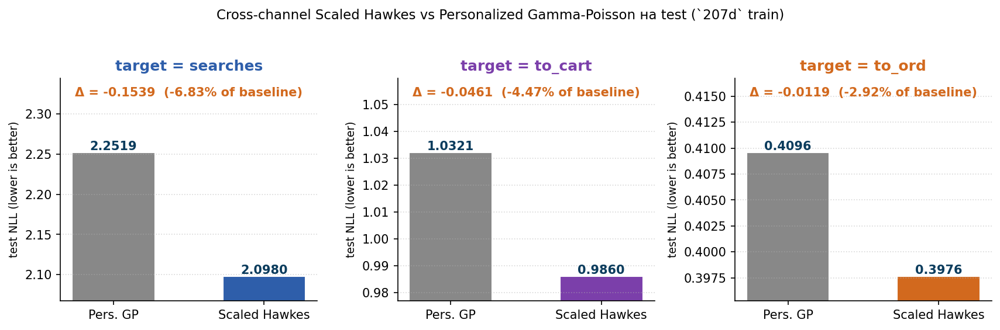

<!--
Тот же функциональный вид. Новое — оцениваем 9 коэффициентов одновременно. Верификация снизу: Scaled Hawkes улучшает Pers GP на всех 3 каналах (`searches` -6.8%, `to_cart` -4.5%, `to_ord` -2.9%) — значит Hawkes-сигнал есть в каждом target'е.
-->

---

<!-- _class: tight -->

## Cross-channel `α`: главный train vs bootstrap

 

- Слева: главный train `207d`.
- Справа: mean ± std по 10 случайным `100d`-окнам.

Эффект вырождения Hawkes на коротких train, виденный ранее в train-length scan (гл. 11), повторился и для cross-channel матрицы. Все коэффициенты на `100d` существенно ниже, чем на главном `207d`: diagonal `searches`/`to_cart` просели на `~37%` и `~51%`, off-diagonal — на `30..63%`, а self-`α[to_ord ← to_ord]` коллапсирует практически в ноль (`0.019 → 0.002`, CV `148%`).

<!--
EB-prior зажимает per-user μ к нулю для редко-активных юзеров — у оптимизатора нет signal для self-α редкого target'а. На коротких train этот эффект усиливается и распространяется на всю матрицу.
-->

---

<!-- _class: tight -->

## Регуляризация: Scaled vs Joint `λ_l2=1` vs Joint `λ_l2=0`

Коэффициенты кросс-Hawkes матрицы сильно зависят от регуляризации. При этом регуляризация может быть структурной — как между Personalized Gamma-Poisson и Joint Hawkes — либо численной, как внутри самого Joint Hawkes (`λ_l2 = 1` vs `λ_l2 = 0`).

<!--
Структурная — это выбор модели/prior'а на per-user multiplier (EB shrinkage к нулю vs L2 к единице). Численная — сила того же L2 внутри Joint Hawkes.
-->

---

<!-- _class: tight -->

## Регуляризация на `207d`: масса vs скор

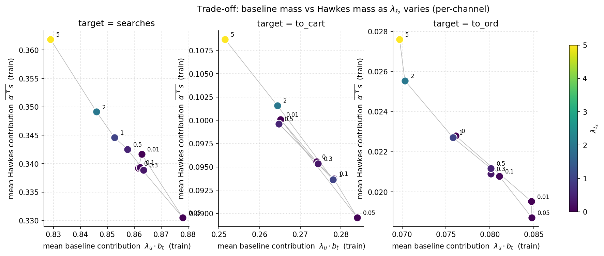

С ростом `λ_l2` масса перетекает из baseline `λ_u · b_t` в Hawkes `α^⊤ z`. Сильнее всего на `to_ord`.

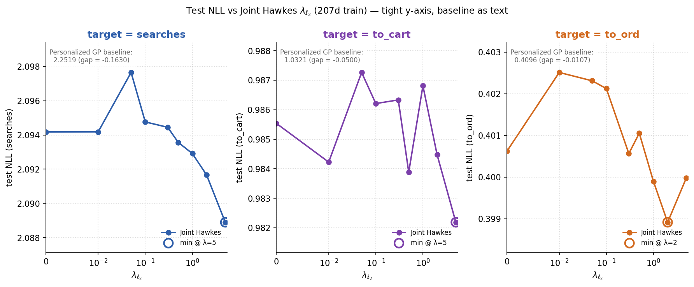

Test NLL почти не меняется: range ≈ `0.009`/`0.005`/`0.004` нат/n.

Регуляризация сильно перераспределяет массу, но слабо влияет на скор.

<!--
На уровне скоринга разные λ_l2 эквивалентны, на уровне внутренних параметров — нет. Насколько данные определяют α?
-->

---

<!-- _class: tight -->

## Где `λ_l2` меняет `α`, а где нет

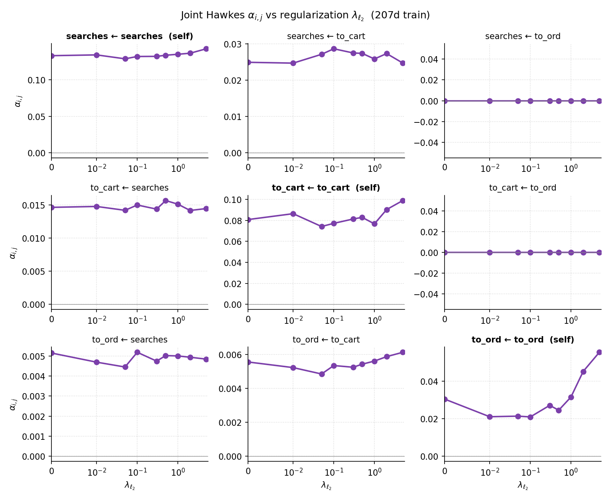

- Колонка `to_ord` — уверенно обнуляется.
- Внедиагональные элементы относительно устойчивы (`±2..10%` по `λ_l2 ∈ [0, 5]`).
- Диагональные элементы устойчивы в меньшей мере. Особенно сильно меняется `α[to_ord ← to_ord]`: `+82%` (`0.030 → 0.055`).

Test NLL по сетке почти не двигается → на `207d` train существует множество `(λ_u, α)`-решений с одинаковым качеством; диагональные элементы пробегают широкий диапазон внутри него.

<!--
Off-diagonal жёсткие, диагональ — широкая. Дальше — прямо в ландшафт NLL вокруг каждого α[i,j].
-->

---

<!-- _class: tight -->

## Profile NLL по 9 коэффициентам — train и test

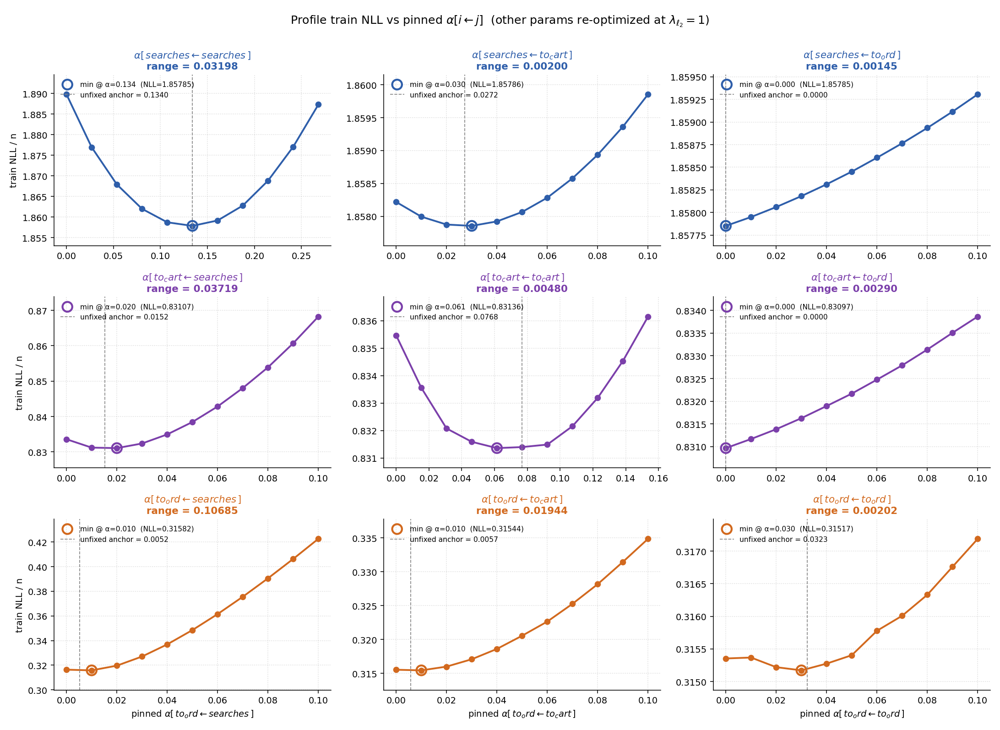 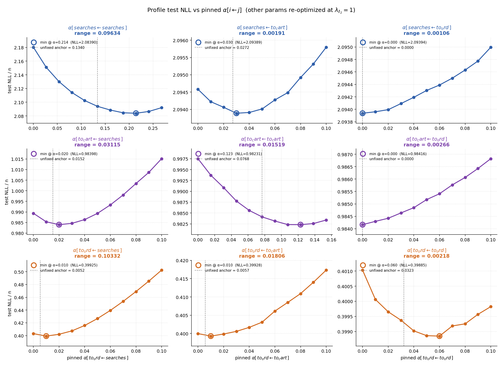

Для каждой пары `(target, source)`: фиксируем `α[i,j]` на широкой сетке из 11 значений, остальные параметры оптимизуем по NLL, считаем train NLL (слева) и test NLL (справа).

- Топология NLL на внедиагональных элементах совпадает для train и test. Для диагональных элементов структура другая.
- Структура слабо зависит от регуляризации, с которой обучаем 11 коэффициентов: фиты с `λ_l2 = 1` и `λ_l2 = 0` дают схожие картины.

<!--
Идентифицируемость — свойство геометрии данных, а не выбор регуляризации.
-->

---

<!-- _class: tight -->

## Асимметрия между диагональными и внедиагональными коэффициентами

Эмпирическое наблюдение: диагональные Hawkes-элементы дрейфуют под изменением регуляризации; внедиагональные — более стабильны.

Причина — коллинеарность history-state и baseline:

$$
\lambda_{u,t}^{(k)} \;=\; \underbrace{\lambda_u^{(k)} \cdot b_t}_{\text{baseline}} \;+\; \underbrace{\alpha_{kk}\,z_{u,t}^{(k)}}_{\text{диагональный Hawkes}} \;+\; \sum_{j \neq k} \alpha_{kj}\,z_{u,t}^{(j)}
$$

- Для диагональных: $\mathbb{E}[z_{u,t}^{(k)}] \propto \lambda_u^{(k)} \cdot b_t$ — тот же сигнал, что и baseline. Линейная комбинация двух почти коллинеарных регрессоров.
- Для внедиагональных: $z_{u,t}^{(j)}$ описывает другой канал, не дублирует baseline → коэффициент идентифицируем.

В литературе:

- Bacry, Bompaire, Gaïffas, Muzy (2020, JMLR) — предлагают separate regularization для диагональных (`ℓ_1`) и внедиагональных (trace norm) — именно потому, что диагональ absorbs baseline mass.
- Achab, Bacry, Gaïffas, Mastromatteo, Muzy (2018, JMLR) — отказываются от MLE в пользу integrated cumulants, чтобы обойти diagonal/baseline non-identifiability.

<!--
То, что мы видим эмпирически — диагональ дрейфует, внедиагональные стабильны — это не артефакт нашей конкретной модели, а структурное свойство multivariate Hawkes с непустым baseline. В литературе для этой же проблемы используют либо раздельную регуляризацию, либо вообще уходят от MLE.
-->

---

<!-- _class: tight -->

## Интервалы 10%-gain над baseline

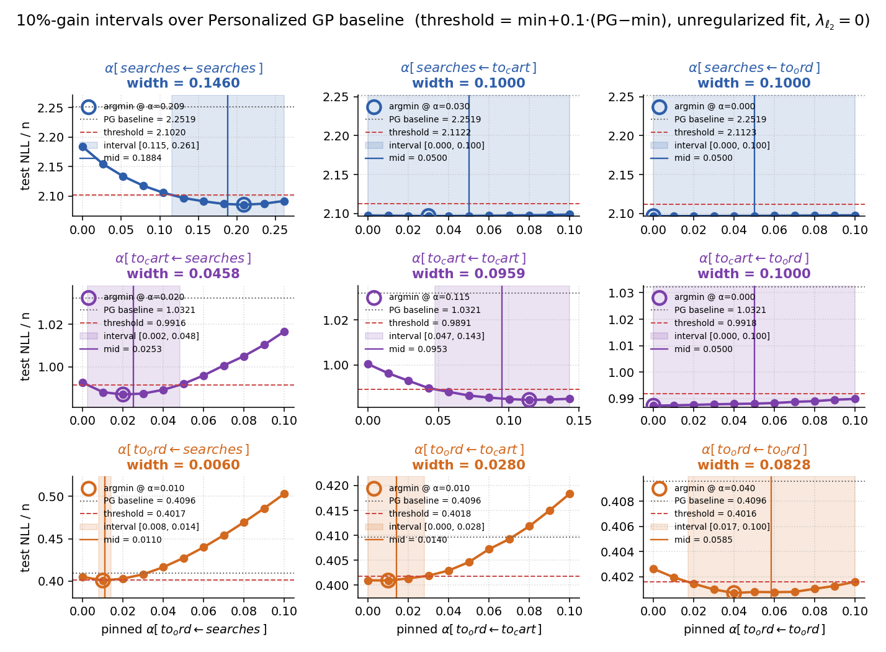

- Верхний треугольник: данные не реагируют → структурно нули.
- Диагональ: широкие интервалы (`α[s←s] ∈ [0.12, 0.26]`, self-`to_ord ∈ [0.02, 0.10]`).
- Нижний треугольник: узкие (`to_ord ← s ∈ [0.008, 0.014]`).

Даже на `207d` многие коэффициенты либо незначимы, либо лежат в широком интервале.

<!--
Идентифицируемость каждой ячейки — что данные о ней «знают», а что нет.
-->

---

<!-- _class: tight -->

## Финальная Hawkes-матрица: midpoint'ы

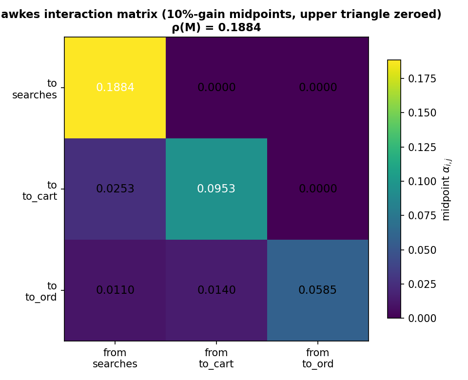

| target ↓ \ src → | `s` | `c` | `o` |
| --- | ---: | ---: | ---: |
| `searches` | `0.188` | `0` | `0` |
| `to_cart`  | `0.025` | `0.095` | `0` |
| `to_ord`   | `0.011` | `0.014` | `0.059` |

Матрица нижнетреугольная по convention воронки → собственные значения = диагональ:

- `|eigvals|` = `[0.059, 0.095, 0.188]`
- `ρ(M) = 0.188` — `ρ < 1`, далеко от explosion-порога.

<!--
Внутри широких 10%-интервалов — один интерпретируемый midpoint-ответ. Hawkes stable.
-->

---

## Выводы

1. Персонализация с байесовской регуляризацией — крупный шаг по NLL. Добавление Hawkes-ядер улучшает метрику ещё сильнее, и эта добавка стабильная.
2. Hawkes-сигнал в данных есть — как видно из первого пункта. Однако он слабый и неоднородный по разным кросс-Hawkes зависимостям. Из-за сильной корреляции между диагональным Hawkes-сигналом и общим baseline'ом диагональные элементы учатся сложно: большая неопределённость по ним сохраняется даже на `207d` train. Важно, что это структурная особенность, а не огрехи обучения.
3. Бустинг даёт улучшение, но небольшое — потолок предсказательной силы низкий из-за шума. Применимость ограничена сложностью интерпретации.

<!--
Спасибо за внимание. Готов к вопросам.
-->
