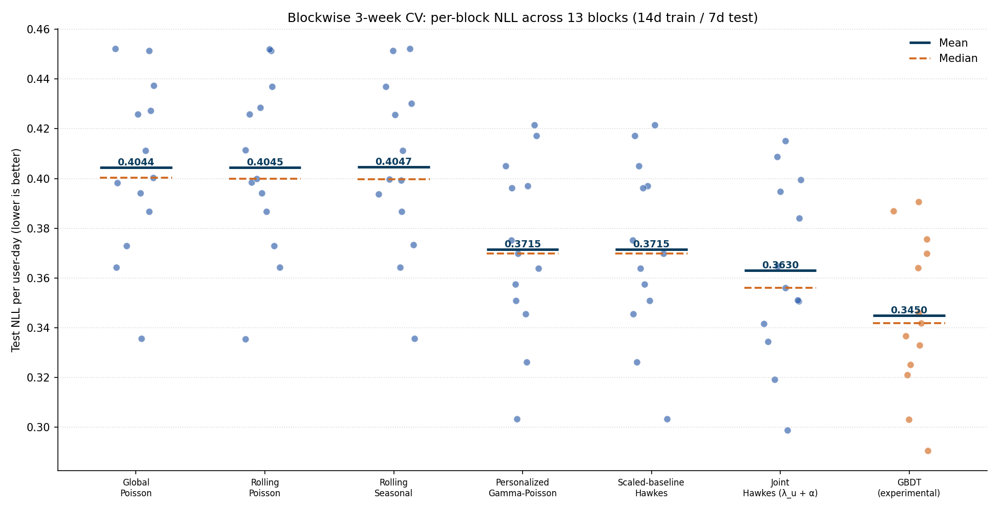
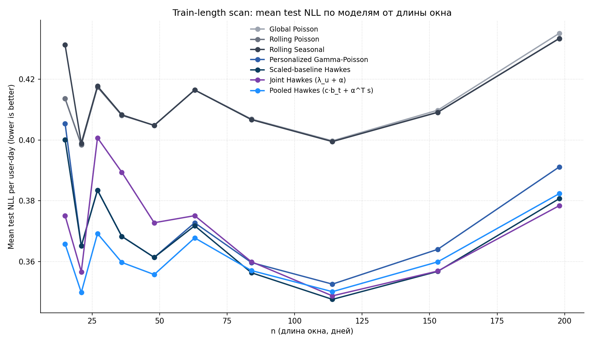
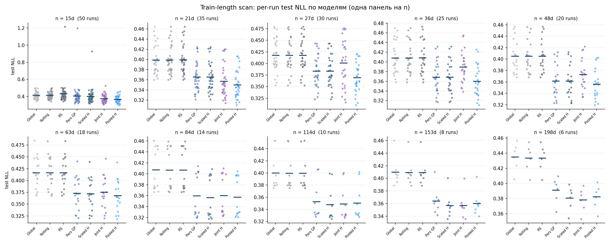
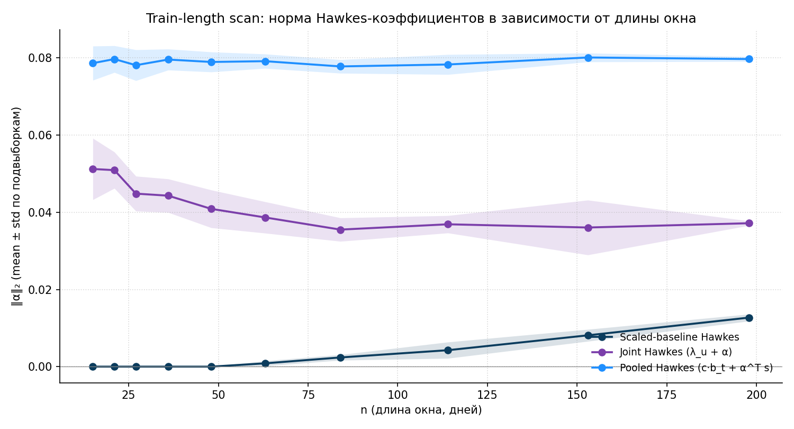
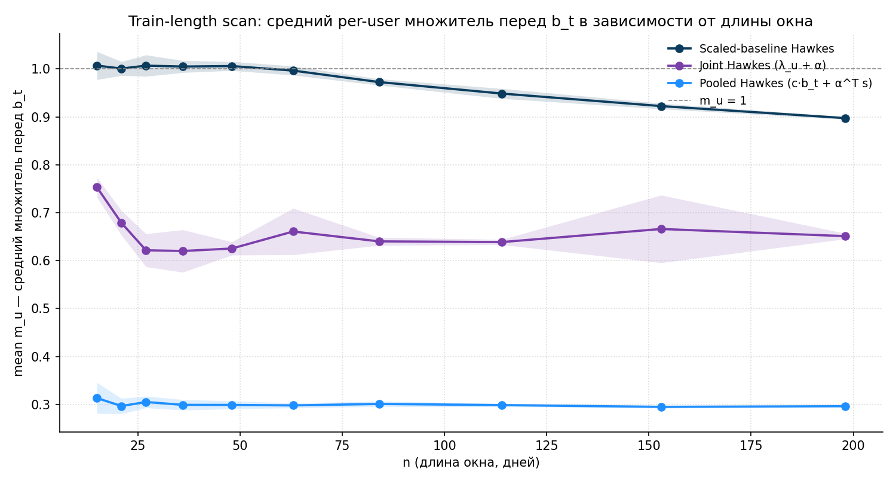

<!-- _class: lead -->

# Применимость процессов Хокса для предсказания пользовательской активности в e-commerce

**Алексей Мошкин**
МКН СПбГУ, 2026

<!--
Это предзащита моей дипломной работы. Расскажу постановку, основные модели, и где Hawkes-процессы дают реальный выигрыш, а где — нет.
-->

---

## Цель работы

**Исследовать границы применимости процессов Хокса для предсказания дневной интенсивности покупок пользователя в e-commerce.**

Подзадачи:

1. Построить иерархию вероятностных моделей от простых baseline'ов до Hawkes-вариантов.
2. Исследовать, как длина train-окна влияет на качество обучения Hawkes-модели.
3. Понять, где Hawkes-надстройка приносит реальную ценность, а где сливается с per-user multiplier'ом.

<!--
Главный вопрос работы — не просто "лучший скор", а понимание структурно: при каких длинах train разные параметризации Hawkes выигрывают.
-->

---

## Данные

- `~10K` пользователей × `~290` дней (`2025-01-15` → `2025-10-31`).
- На каждый `(user, day)` доступны 5 поведенческих счётчиков: `searches`, `cat_to_cart`, `cat_to_ord`, `to_cart`, **`to_ord`** — последний и есть **target**.

Среднее число покупок на user-day — `~0.10`. То есть **`93.7%` ячеек панели — нули**, данные сильно разрежены.

<!--
Когорта в 10K юзеров — случайная подвыборка, фиксированный seed. Достаточно для статистики, не слишком тяжёлая для итераций.
-->

---

## Распределение числа покупок на user-day

- **`93.7%`** user-days — нули.
- Тяжёлый правый хвост: единичные `(user, day)` с десятком покупок и больше.
- `18%` самых активных юзеров делают **`62%`** всех покупок.

<!--
Лог-шкала по Y нужна, чтобы одновременно увидеть колоссальную долю нулей и редкий правый хвост.
-->

---

## Дневная интенсивность на полном ряду

Видно три режима:

1. **первые две недели января** — аномально высокая активность (NY-промо/подарки);
2. **середина января → конец сентября** — основное стабильное окно;
3. **октябрь** — снова повышенный уровень.

<!--
Анализируемое окно фиксировано во всех экспериментах, чтобы NY-всплеск не путался с настоящим signal'ом. Анализируемое окно — 2025-01-15 .. 2025-10-31 (для гл.10–11 включая октябрь, для гл.9 без него).
-->

---

## Что мы предсказываем и метрика качества

Для каждой пары `(user, day)` оцениваем интенсивность `λ_{u,t}`:

$$
y_{u,t} \mid \lambda_{u,t} \sim \mathrm{Poisson}(\lambda_{u,t}).
$$

Метрика — **mean Poisson NLL** на тесте:

$$
\mathrm{NLL} = \frac{1}{N} \sum_{u,t} \left[ \lambda_{u,t} - y_{u,t} \log \lambda_{u,t} + \log y_{u,t}! \right].
$$

Минимум NLL ≠ 0 — **saturated Poisson floor ≈ `0.086`**: даже идеальная модель не закроет всю aleatoric uncertainty.

Дополнительно для диагностики:

$$
\mathrm{MAE} = \frac{1}{N} \sum_{u,t} |y_{u,t} - \hat\lambda_{u,t}|, \qquad
\mathrm{RMSE} = \sqrt{\frac{1}{N} \sum_{u,t} (y_{u,t} - \hat\lambda_{u,t})^2}.
$$

<!--
NLL естественна для счётных данных и согласуется с модельным предположением. Saturated floor показывает теоретический предел снизу.
-->

---

## Лестница базовых моделей (главы 1–4)

| Шаг | Модель | Что добавили |
| ---: | --- | --- |
| 1 | Global Poisson | константа `λ̄` |
| 2 | Rolling Poisson | rolling mean уровня |
| 3 | Rolling Seasonal | + day-of-week |
| 4 | **Personalized Gamma-Poisson** | per-user `μ_u` через EB |

<!--
До personalization все модели практически одинаковые. Это объяснимо: разброс между юзерами куда больше, чем между днями.
-->

---

## Rolling baseline: динамика уровня

Видно, что стоит попробовать идеи rolling и недельной сезонности.

<!--
Глобальный Poisson сильно недооценивает уровень test-периода (~0.103 vs 0.130). Rolling baseline почти полностью убирает aggregate bias и за счёт этого заметно выигрывает в log-likelihood.
-->

---

## Personalized Gamma-Poisson — Empirical Bayes

Модель: `y_{u,t} ~ Poisson(μ_u · b_t)`, `μ_u ~ Gamma(α, β)`.

Posterior:
$$
\hat\mu_u^{\mathrm{EB}} = \frac{\alpha + Y_u}{\beta + E_u}.
$$

`(α, β) ≈ (0.88, 0.88)` оцениваются marginal MLE'ем по `(Y_u, E_u)` пары пар.

<!--
Это самая мощная "простая" модель. Дальше любые улучшения идут уже только на её фоне. Малоактивные юзеры тянутся к α/β ≈ 1, активные — к raw MLE; без shrinkage NLL = 0.4650 против EB 0.4096.
-->

---

## Per-observation NLL: лестница базовых моделей

Самый крупный шаг — **персонализация** (`+24K` нат LL); уровень и сезонность дают по чуть-чуть.

<!--
Saturated Poisson floor ≈ 0.0862. Шаги global → rolling → seasonal — практически плато; следующий шаг (персонализация) даёт уже большой gap. Дальше будет ещё одна ступень — Hawkes.
-->

---

## Переход глава 3 → глава 4: per-user delta-LL

- `share(personalized > rolling seasonal) = 66%`;
- юзеры с `0..2` покупок выигрывают почти всегда (`87..94%`);
- бакет `6..10` покупок — наоборот, проигрывает (`18%`): shrinkage тянет слишком сильно;
- `11+` снова выигрывает за счёт `μ_u`.

<!--
Эта диагностика показывает, что улучшения от персонализации распределены неоднородно. Это будет важно ниже — Hawkes-надстройка будет работать поверх этой персонализации.
-->

---

## Hawkes-процессы: базовое определение

**Self-exciting point process** — интенсивность зависит от истории своих событий:

$$
\lambda(t) = \mu + \sum_{t_i < t} \alpha \cdot \exp\!\left(-\beta (t - t_i)\right).
$$

В дискретно-дневной форме для юзера `u`:

$$
\lambda_{u,t} = \mu + \sum_{j} \alpha_j \cdot z_{u,j,t},
$$

где:

- `z_{u,j,t}` — exp-decay-сглаженная история фичи `j` юзера до дня `t`;
- `α_j` — pooled Hawkes-веса.

<!--
Главное: каждое событие пользователя экспоненциально "поджигает" будущую интенсивность. Half-lives задают временные масштабы памяти — у нас 1 и 3 дня.
-->

---

## Анализ фичей: матрица корреляций

Каналы `search_to_cart` и `search_to_ord` сильно скоррелированы с `to_cart` и `to_ord` (`r > 0.9`).

→ **исключены** из основной Hawkes-модели; остаётся 5 фичей вместо 7.

<!--
Это снижает collinearity в Hawkes-states и упрощает интерпретацию α-матрицы.
-->

---

## Scaled-baseline Hawkes (глава 6): модель и обучение

$$
\lambda_{u,t} = c \cdot \mu_u^{\mathrm{EB}} \cdot b_t + \sum_{j,m} \alpha_{j,m} \, z_{u,j,m,t}.
$$

- baseline `μ_u^{EB} · b_t` зафиксирован (Personalized GP из гл.4);
- 5 фичей × 2 half-life `(1, 3)` дня → `10` параметров `α` + `1` глобальный `c`.

**Loss** (регуляризованный Poisson NLL на train):

$$
\mathcal{L}(c,\alpha) = -\log p\!\left(y \mid c\lambda_{\mathrm{base}} + X\alpha\right) + \lambda_\alpha \|\alpha\|_2^2 + \lambda_c (c-1)^2.
$$

**Staged**: сначала EB (гл.4) → потом L-BFGS-B по `(c, α)` с `α ≥ 0`. В разделе 6.10 показано, что результат не зависит от выбора `λ_α, λ_c` в широком диапазоне.

<!--
Регуляризация на 11 параметрах при ~2M user-day на train не нужна почти ни в каком виде. Этот результат явно подтверждён сетками в гл.6.10.
-->

---

## Scaled-baseline Hawkes: результаты

| Метрика | Pers. GP | Scaled Hawkes | Δ |
| --- | ---: | ---: | ---: |
| Test NLL | `0.4096` | **`0.3958`** | `−0.0138` |
| Test `LL` | `−210167` | `−203093` | `+7074` |
| `MAE` | `0.2187` | `0.2169` | `−0.0018` |
| `RMSE` | `0.6314` | `0.6272` | `−0.0042` |

Обученные параметры:
`ĉ = 0.83`, `‖α‖₂ = 0.016`.

Основной сигнал — `to_ord (hl=3)`, плюс `searches`, `to_cart` на коротких масштабах.

<!--
Hawkes даёт устойчивое улучшение, но не радикальное. Модель чуть занижает baseline (c ≈ 0.83) и компенсирует Hawkes-надстройкой.
-->

---

## Scaled-baseline Hawkes: per-user delta-LL

- `share(Hawkes > Personalized GP) = 63.4%`;
- mean / median delta-LL: `+0.71` / `+0.16`;
- по бакетам `0..11+` покупок Hawkes выигрывает у `54..80%` юзеров — gain массовый, а не локальный.

<!--
Это второй критичный момент: в отличие от перехода 3→4 здесь нет явных проигрывающих бакетов — Hawkes-надстройка работает поверх уже выровненного persoanlized baseline'a.
-->

---

## Tree-based подход и trade-off

**GBDT (HistGradientBoostingRegressor, Poisson loss)** на расширенном feature-engineering — всего **`141` фича**, 5 групп:

- **календарь** (`dow`, `days_seen`, `week_idx`);
- **history по 14 исходным сигналам**: `*_yesterday`, `*_sum3/7`, `*_mean7`, `*_active_days7`, `*_exp3`, `*_last_active`, `*_days_since_last_active`;
- **EMA**: `*_ewm7`, `*_ewm28`, `*_ewm_gap_7_28` для `to_ord`, `to_cart`, `any_activity`;
- **общие агрегаты по заказам и активности** (`orders_hist_mean`, `carts_hist_mean`, …);
- **recency и funnel-ratio**: `days_since_last_*`, `ord_per_cart_7`, `*_rate_7`.

Test NLL `0.3881` — **лучше всех Hawkes-моделей** (`+3K..7K` нат). Но **нет интерпретируемости**: какие фичи когда работают.

**Trade-off**: GBDT — лучший скор, Hawkes — структурное понимание `(c, μ_u, α)`. В дипломе GBDT отмечен отдельным цветом — reference point, а не research-линия.

<!--
Деревья — апельсины к нашим яблокам. Они хорошо ловят нелинейные взаимодействия, но не дают про per-user интенсивность ничего интерпретируемого.
-->

---

## Лестница моделей (глава 9)

`−0.048` NLL от персонализации, `−0.014` от Hawkes-надстройки, `−0.001` от joint vs staged. GBDT — отдельная ветка.

<!--
Главный вывод этой картинки: основной выигрыш — персонализация. Hawkes — заметная, но скромная добавка относительно EB.
-->

---

## Переход к другим train-test (глава 10)

**Blockwise CV**: `13` непересекающихся `21d`-блоков, каждый = `14d train + 7d test`.

На коротких train **картина меняется**: появляется новый лидер среди вероятностных моделей — Pooled Hawkes.

<!--
Главное наблюдение: Scaled-baseline Hawkes на 14d ВЫРОЖДАЕТСЯ в Personalized GP (c=1, α=0). EB-shrunk база коллинеарна Hawkes-сигналу. На длинных train этой проблемы нет.
-->

---

## Новые Hawkes-варианты (главы 7, 8)

**Pooled Hawkes** (гл.7): per-user multiplier'a **нет вообще**.

$$
\lambda_{u,t} = c \cdot b_t + \alpha^\top s_{u,t}.
$$

Всего `11` параметров. Персонализация через **per-user states** `s_{u,t}`.

**Joint Hawkes** (гл.8): `λ_u` и `α` обучаются **одновременно** с регуляризацией `(λ_u − 1)²`.

$$
\lambda_{u,t} = \lambda_u \cdot b_t + \alpha^\top s_{u,t}.
$$

`~10K + 10` параметров; нет двухступенчатости как у staged.

<!--
Идея Pooled: убрать static personalization, всё переложить на dynamic Hawkes. Идея Joint: не фиксировать μ_u до Hawkes-fit'а — позволить им договариваться между собой.
-->

---

## Train-length scan (глава 11)

Sweep по `n` от `15` до `198` дней; `m` случайных интервалов на каждое `n`; `2n/3` train + `n/3` test.

Crossover'ы:

- `n ≤ 60`: **Pooled Hawkes** доминирует.
- `n ∈ [60, 100]`: модели сходятся.
- `n ≥ 100`: **Scaled-baseline Hawkes** ≈ **Joint Hawkes** ≈ best probabilistic.

<!--
Это самый ёмкий результат работы. Видно, что нет "универсально лучшей" Hawkes-модели — выбор зависит от длины train.
-->

---

## Per-run NLL по моделям для каждого `n`

Каждая панель — одно значение `n`; точки — отдельные подвыборки, синяя черта — среднее.

<!--
То же самое, но без усреднения: видно дисперсию по подвыборкам и стабильность ранжирования моделей внутри каждого n.
-->

---

## Поведение Hawkes-параметров от длины train

 

- **Scaled-baseline**: до `n ≈ 50` — `‖α‖ = 0`, `c = 1`. Полное вырождение.
- **Joint**: `‖α‖ ≈ 0.04..0.05` — стабильный сигнал на всех `n`.
- **Pooled**: `‖α‖ ≈ 0.08`, `c ≈ 0.30` — практически константы.

<!--
Левый график — норма Hawkes-коэффициентов; правый — средний per-user множитель перед b_t. На коротких train у staged Hawkes регуляризация не виновата, а EB-база впитывает Hawkes-сигнал.
-->

---

## Выводы

1. **Персонализация с байесовской регуляризацией** — крупный шаг по NLL. Добавление Hawkes-ядер улучшает метрику ещё сильнее, и эта добавка **стабильная**.
2. Данные очень шумные. При похожих по форме моделях остро встаёт вопрос **как обучаться** — именно он порождает то, что Hawkes в итоге представлен **тремя близкими вариантами**.
3. **Pooled Hawkes** — максимально простой, не переобучается и подходит для очень коротких train-окон; но на длинных проигрывает более сложным **Scaled-baseline** и **Joint Hawkes**.
4. Эффект от Hawkes-ядер поверх сильного personalized Poisson **сохраняется** на всех режимах. Просто в зависимости от размера train **нужно выбирать правильную Hawkes-параметризацию**.
5. **Бустинг** даёт улучшение, но небольшое — потолок предсказательной силы низкий из-за шума. Применимость ограничена сложностью интерпретации.

<!--
Спасибо за внимание. Готов к вопросам.
-->
